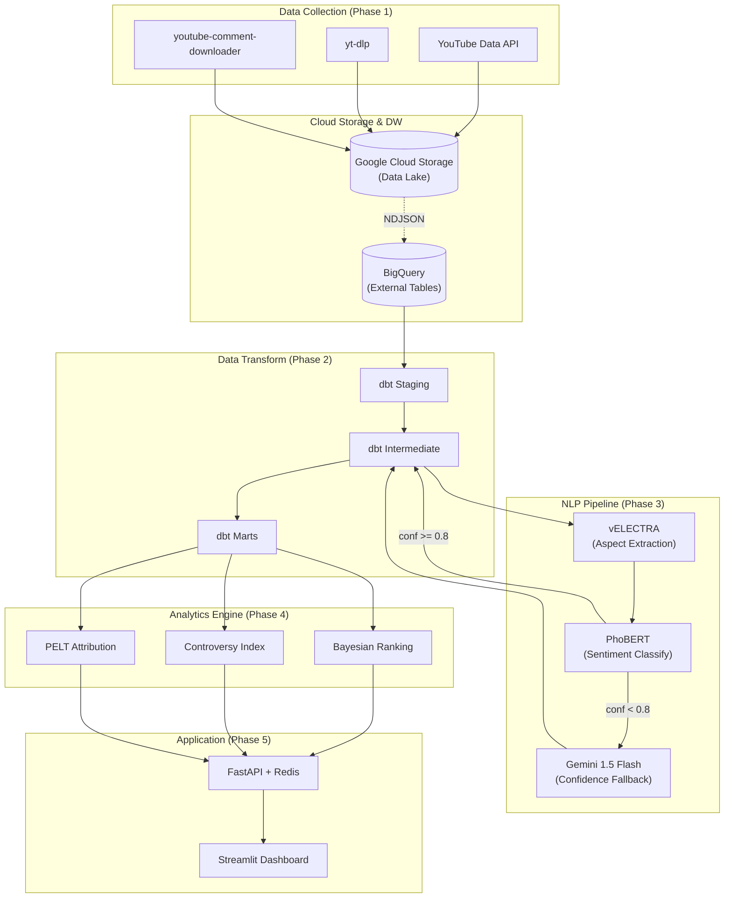
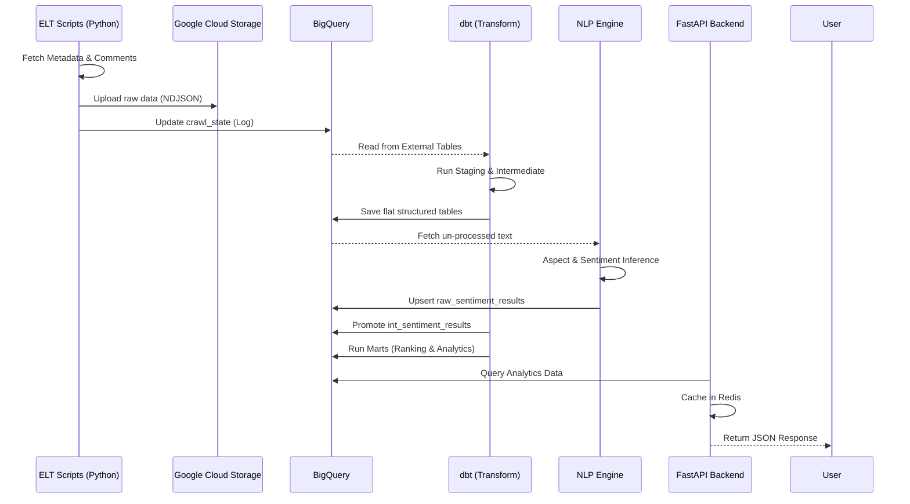
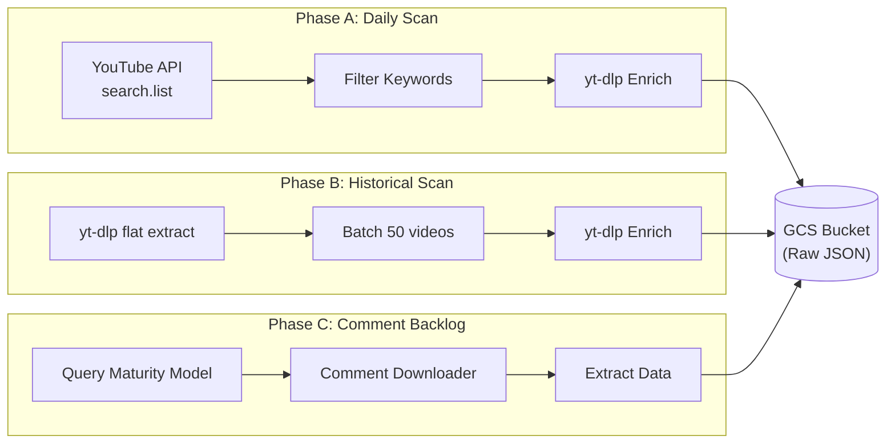

# 🌟 Sentiment Intelligence Platform

[](https://www.python.org/downloads/release/python-3130/)
[](https://www.getdbt.com/)
[](https://fastapi.tiangolo.com/)
[](https://streamlit.io/)
[](https://cloud.google.com/)

Hệ thống end-to-end phân tích cảm xúc (Sentiment Analysis) đa khía cạnh dành cho bình luận YouTube về các sản phẩm công nghệ Việt Nam (smartphone, laptop, thiết bị smarthome). Đồ án tốt nghiệp 2026.

---

## 📖 Giới thiệu Dự án

**Sentiment Intelligence Platform** không chỉ là một tool phân tích cảm xúc thông thường, mà là một **Data Platform** hoàn chỉnh bao gồm:

- 🚀 **Tối ưu Quota Ingestion**: Sử dụng YouTube API v3 với định mức giới hạn cho Phase A (Daily Scan). Tích hợp `yt-dlp` (0 quota) cho Phase B (Historical Scan) và `youtube-comment-downloader` (0 quota) để thu thập dữ liệu khổng lồ, đảm bảo không bao giờ vượt giới hạn.
- 🧠 **Hybrid NLP Pipeline**: Sử dụng `vELECTRA` để nhận diện khía cạnh (Aspect Extraction) và `PhoBERT` để phân loại cảm xúc (Sentiment Classification), kết hợp cơ chế **Confidence-Routing** tự động fallback sang Gemini nếu độ tin cậy < 70%.
- 📊 **Advanced Analytics**: Áp dụng **Bayesian Ranking** (chống thiên kiến sản phẩm ít review), **Controversy Index** (chỉ số gây tranh cãi), và **Correlation Attribution Engine** sử dụng thuật toán PELT để giải thích nguyên nhân đột biến cảm xúc.

### 1. Kiến trúc hệ thống (System Architecture)


### 2. Biểu đồ tuần tự hoạt động dữ liệu (Data Flow Sequence Diagram)


### 3. Biểu đồ Workflow Quá trình ELT (ELT 3-Phase Workflow)


---

## ⚙️ Yêu cầu Hệ thống & Cài đặt

Dự án hiện tại được tối ưu để chạy cục bộ (Local) qua môi trường Conda nhằm tránh overload cho máy cấu hình giới hạn (khuyến nghị RAM 16GB).

### 1. Yêu cầu trước khi cài đặt (Prerequisites)
- **Miniconda / Anaconda** (Python 3.13).
- Tài khoản **Google Cloud Platform (GCP)**: Cần tạo Service Account (Role: BigQuery Admin & Storage Admin), lấy file `credentials.json`.
- GCS Bucket: Tạo bucket `product-sentiment-raw-1806` (Region `asia-southeast1`).
- BigQuery Dataset: Tạo dataset `sentiment_platform` (Region `asia-southeast1`).
- **Gemini API Key**: Đăng ký từ Google AI Studio (Miễn phí).

### 2. Cài đặt môi trường
Clone repository và thiết lập môi trường Conda:

```bash
git clone <repository-url>
cd Social_media_sentiment_pipeline

# Tạo và kích hoạt môi trường conda
conda create -n etl-py313 python=3.13
conda activate etl-py313

# Cài đặt thư viện
pip install -r requirements.txt
```

### 3. Thiết lập biến môi trường (.env)
Tạo file `.env` ở thư mục gốc (hoặc copy từ `.env.example`) và điền các thông tin:

```env
GCP_PROJECT_ID=your_project_id
GCS_BUCKET_NAME=product-sentiment-raw-1806
BQ_DATASET=sentiment_platform
GOOGLE_APPLICATION_CREDENTIALS=/path/to/your/service_account.json

YOUTUBE_API_KEY=your_youtube_api_key
GEMINI_API_KEY=your_gemini_api_key

# (Tùy chọn) Cấu hình Proxy nếu cần thiết để bypass rate-limit
# BRIGHTDATA_PROXY_HOST=your_proxy_host
# BRIGHTDATA_PROXY_PORT=your_proxy_port
# BRIGHTDATA_USERNAME=your_username
# BRIGHTDATA_PASSWORD=your_password
```

---

## 🚀 Hướng dẫn Chạy Dự án Từng Bước

Pipeline được chia thành 5 giai đoạn chạy nối tiếp nhau. Bạn cần chạy lần lượt:

### Bước 0: Khởi tạo Schema (Chỉ chạy 1 lần)
Chạy script để khởi tạo toàn bộ các bảng cấu hình (Layer 0) và External Tables (Layer 1) trên BigQuery để đọc file NDJSON từ GCS:
```bash
conda activate etl-py313
python -m schema.run_all
```

### Bước 1: Thu thập Dữ liệu (Giai đoạn Ingestion)
Script ELT sẽ lo việc thu thập metadata và comments, tự động lưu thành định dạng **NDJSON** đẩy lên GCS, sau đó lưu trạng thái vào BigQuery.
```bash
conda activate etl-py313
python -m elt.main --mode full
```
*Script tự động xử lý Phase A (Daily), Phase B (Historical), và Phase C (Backlog).*

### Bước 2: Data Transformation (dbt)
Biến đổi dữ liệu thô thành các bảng phân tích (Staging ➔ Intermediate ➔ Marts).
```bash
# Đảm bảo bạn đang ở thư mục gốc
# Chạy thông qua script runner an toàn:
conda run -n etl-py313 python scripts/dbt/dbt_runner.py run
# Hoặc trên Windows, bạn có thể double click vào file run_dbt.bat
```

### Bước 3: Phân tích Cảm xúc (NLP Pipeline)
Chạy pipeline AI hybrid. Mô hình PhoBERT và vELECTRA đã được train và tải weights về local trong `models/`.
```bash
conda activate etl-py313
python -m nlp.runner --limit 500 --dag-run-id manual-nlp-500-t070
cd transform
python -m dotenv -f ..\.env run -- dbt run --profiles-dir . --select int_sentiment_results fact_product_mentions
```

### Bước 4: Analytics Engine (Ranking & Causality)
Tính toán các chỉ số nâng cao (Bayesian Score, Controversy Index, PELT Attribution).
```bash
conda activate etl-py313
python -m schema.layer_4_marts.init_marts_tables
conda run -n etl-py313 python scripts/dbt/dbt_runner.py run --select agg_daily_product_ranking
python -m analytics.pelt_attribution --dry-run
```

### Bước 5: Khởi động Dashboard & API
1. Mở Terminal 1 (Khởi chạy FastAPI Backend):
```bash
conda activate etl-py313
uvicorn api.main:app --reload --host 0.0.0.0 --port 8000
```
2. Mở Terminal 2 (Khởi chạy Streamlit Dashboard):
```bash
conda activate etl-py313
streamlit run dashboard/app.py
```

---

## 🛠 Hướng dẫn Debug (Troubleshooting)

### Giai đoạn 1: Data Ingestion (ELT)
- **Lỗi không ghi được data lên BigQuery**: Kiểm tra xem file đẩy lên GCS đã đúng định dạng NDJSON chưa (`gcs_client.py` lo việc này). BigQuery External Tables sẽ báo lỗi Parsing nếu file là chuẩn JSON array.
- **Lỗi Quota YouTube**: Kiểm tra log trong bảng `quota_operation_log` trên BigQuery xem bucket `SEARCH` có vượt quá giới hạn 9000 units/ngày hay không (Xảy ra nếu Phase A cấu hình quét quá nhiều kênh).

### Giai đoạn 2: dbt Transformation
- **Lỗi Not Found Dataset/Table**: Đảm bảo trong `transform/profiles.yml` đã khai báo đúng biến `location: asia-southeast1`. Dbt sẽ tạo table ở region mặc định (US) nếu không cấu hình explicitly, gây lệch region với GCS data lake.
- **Cách debug dbt**: Bạn có thể test kết nối bằng lệnh:
  `conda run -n etl-py313 python scripts/dbt/dbt_runner.py debug`
  Hoặc chỉ chạy một model bị lỗi:
  `conda run -n etl-py313 python scripts/dbt/dbt_runner.py run --select stg_youtube_videos`

### Giai đoạn 3: NLP Pipeline
- **Lỗi Tokenizer Mismatch**: Đảm bảo phân tách tiền xử lý đúng cho từng model: PhoBERT sử dụng `pyvi` (`ViTokenizer`) và format input `aspect </s> sentence`, còn vELECTRA sử dụng `underthesea.word_tokenize` để tách âm tiết và align nhãn BIO.
- **Lỗi Gemini Fallback**: Threshold hiện tại là `0.70`. Nếu tỷ lệ route sang Gemini quá cao (>20% trên aspect thật), chạy `python -m nlp.runner --limit 500 --debug-local-confidence --output-jsonl scratch\local_confidence_debug_check.jsonl` để phân tách nguyên nhân NER thấp hay sentiment thấp.

### Giai đoạn 4 & 5: API & Dashboard
- **Dashboard load chậm (> 2 giây)**: Đảm bảo Redis caching (TTL=300s) đang hoạt động. Test bằng cách tắt Redis, nếu API báo lỗi connection refused, hãy khởi động lại Redis server.
- **Ranking không hợp lý**: Kiểm tra lại công thức Bayesian Ranking trong bảng `agg_daily_product_ranking` (BigQuery/dbt), đảm bảo `C` (prior strength) không quá nhỏ hoặc quá lớn.

---
*Developed by Khoa Trần (2026)*
