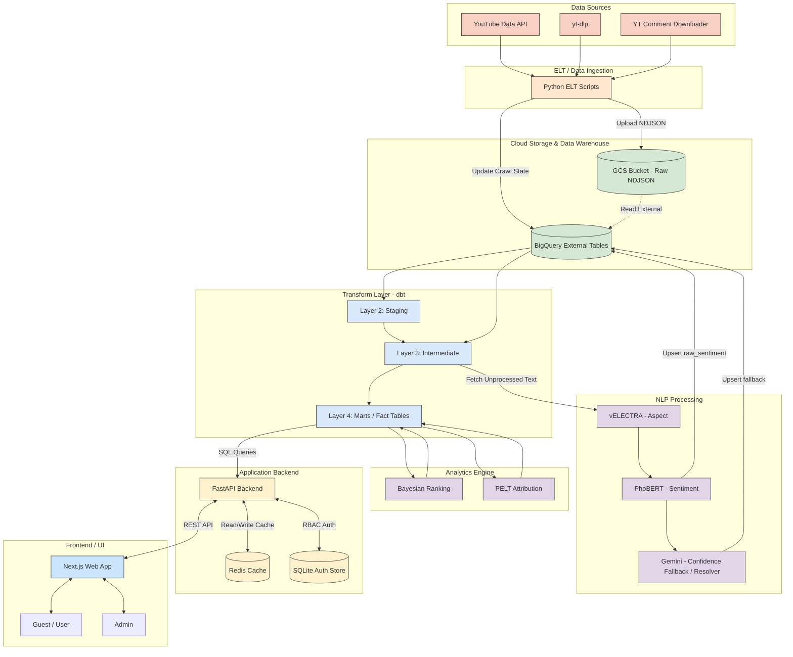

# Báo Cáo Phân Tích Hệ Thống & Đặc Tả Kỹ Thuật

## 1. Tổng quan dự án

**Tên dự án:** Social Media Sentiment Pipeline (Sentiment Intelligence Platform)

**Mục tiêu dự án:**
Xây dựng một Data Platform hoàn chỉnh (end-to-end) để tự động thu thập, lưu trữ, xử lý và phân tích cảm xúc đa chiều (Sentiment Analysis) từ bình luận YouTube liên quan đến các sản phẩm công nghệ Việt Nam (điện thoại, laptop, tai nghe, thiết bị smarthome). Hệ thống giúp định lượng, trực quan hóa và phân tích chuyên sâu thái độ của người tiêu dùng đối với từng khía cạnh (aspect) của sản phẩm.

**Bài toán dự án giải quyết:**
- Tự động hóa quá trình lắng nghe mạng xã hội (Social Listening).
- Hiểu rõ người dùng đang khen hay chê yếu tố nào của sản phẩm (ví dụ: khen pin, chê màn hình), thay vì chỉ biết cảm xúc chung chung của cả bình luận.
- Giải quyết bài toán phân tích các sản phẩm có ít dữ liệu (áp dụng thuật toán Bayesian Ranking để chống thiên kiến).
- Tự động tìm ra nguyên nhân đằng sau sự thay đổi đột ngột về cảm xúc đối với một sản phẩm (Sử dụng mô hình PELT Attribution).

**Người dùng / actor chính của hệ thống:**
- **Guest / User:** Xem dashboard phân tích, tìm kiếm thông tin sản phẩm, đăng ký/đăng nhập, gửi phiếu đề xuất chỉnh sửa thông tin mô tả/thông số kỹ thuật của sản phẩm.
- **Admin:** Kế thừa quyền của User, có toàn quyền quản lý hệ thống: Cấu hình crawl dữ liệu (từ khóa, kênh), quản lý danh mục sản phẩm (catalog, alias, template specs), duyệt phiếu đề xuất chỉnh sửa thông tin từ User, theo dõi tình trạng hoạt động (Health) của Pipeline, và giải quyết các trường hợp NLP không tự nhận diện được sản phẩm (resolve candidate).

**Phạm vi hệ thống:**
Hệ thống bao phủ từ khâu Data Ingestion (thu thập từ YouTube), Data Storage (Data Lake & Data Warehouse), Data Transformation, AI/NLP Processing, Advanced Analytics, cho đến Backend API và Frontend Dashboard.

**Dữ liệu đầu vào:**
- Metadata của video YouTube (Tiêu đề, mô tả, kênh, ngày đăng...).
- Bình luận YouTube (Văn bản, số lượt thích, tác giả, thời gian...).
- Từ khóa tìm kiếm, cấu hình kênh theo dõi.
- Cấu hình danh mục sản phẩm (Product Catalog).

**Dữ liệu đầu ra:**
- Dữ liệu thô (Raw JSON/NDJSON) lưu trên Data Lake.
- Bảng dữ liệu chuẩn hóa (Staging, Intermediate, Marts) trên BigQuery.
- Nhãn cảm xúc (Sentiment) và khía cạnh (Aspect) của từng câu.
- Bảng xếp hạng sản phẩm (Bayesian Ranking), Chỉ số gây tranh cãi (Controversy Index), Phân tích nguyên nhân (PELT Attribution).
- Giao diện Dashboard trực quan phục vụ người dùng cuối.

**Công nghệ sử dụng:**
- **Data Lake:** Google Cloud Storage (GCS).
- **Data Warehouse:** Google BigQuery.
- **ELT & Orchestration:** Python 3.13, yt-dlp, YouTube Data API v3, youtube-comment-downloader, (Airflow DAGs cho tự động hóa).
- **Data Transformation:** dbt-bigquery.
- **NLP / ML:** vELECTRA (Aspect Extraction), PhoBERT (Sentiment Classification), Gemini 1.5 Flash (LLM Fallback), thư viện underthesea & pyvi.
- **Analytics:** ruptures (thuật toán PELT).
- **Backend API:** FastAPI, Redis, SQLAlchemy, SQLite (auth store).
- **Frontend Web App:** Next.js (App Router), TypeScript, Tailwind CSS.

**Giá trị hệ thống mang lại:**
Cung cấp cái nhìn sâu sắc, chính xác, khách quan về thái độ của người dùng đối với các sản phẩm công nghệ. Hỗ trợ các thương hiệu, nhà sản xuất và đội ngũ marketing ra quyết định dựa trên dữ liệu (Data-driven decision making), cải thiện sản phẩm và đo lường hiệu quả truyền thông.

---

## 2. Bối cảnh nghiệp vụ và bài toán

**Vấn đề khi thu thập, phân tích và đánh giá cảm xúc người dùng:**
Dữ liệu trên mạng xã hội, đặc biệt là bình luận YouTube, có đặc thù là khối lượng lớn, không có cấu trúc, chứa nhiều nhiễu, viết tắt, sai chính tả, và thường chứa nhiều ý (nhiều khía cạnh sản phẩm) trong cùng một bình luận. Việc đánh giá thủ công là không khả thi. Hơn nữa, việc chỉ phân loại "Tích cực", "Tiêu cực" cho toàn bộ bình luận không phản ánh đúng thực tế (VD: "Máy này pin trâu nhưng màn hình xấu" - chứa cả ý tích cực và tiêu cực về 2 khía cạnh khác nhau).

**Vì sao cần ELT (Extract, Load, Transform)?**
Mô hình ETL truyền thống thường gặp nút thắt (bottleneck) ở khâu Transform trước khi nạp vào kho dữ liệu. Với ELT, dữ liệu thô (Raw JSON) được trích xuất và nạp (Load) trực tiếp vào Data Lake (GCS) một cách nhanh chóng nhất để tránh mất mát. Sau đó, năng lực tính toán mạnh mẽ của Data Warehouse (BigQuery) được tận dụng để thực hiện việc chuyển đổi (Transform) dữ liệu. Quy trình ELT được thiết kế với 3 phase (Daily Scan, Historical Scan, Comment Backlog) để tối ưu định mức (quota) của YouTube API (10.000 units/ngày) bằng cách kết hợp `yt-dlp` và `youtube-comment-downloader` (0 quota).

**Vì sao cần NLP (Natural Language Processing)?**
Đây là trái tim của hệ thống. NLP giúp trích xuất thông tin tự động từ văn bản bình luận. Hệ thống sử dụng một mô hình lai (Hybrid NLP Pipeline):
- **vELECTRA** thực hiện bài toán Token Classification để nhận diện các khía cạnh (Aspect Extraction).
- **PhoBERT** thực hiện bài toán Sequence Classification để phân loại cảm xúc (Sentiment Classification) trên từng khía cạnh.
Sự kết hợp này giải quyết được vấn đề "tiếng Việt" (vELECTRA và PhoBERT được tối ưu cho tiếng Việt) và "nhiều nhãn/thiếu ngữ cảnh" (nhận diện chính xác khía cạnh trước rồi mới phân tích cảm xúc).

**Vì sao cần Transform và Data Warehouse (BigQuery, dbt)?**
Dữ liệu từ YouTube rất đa dạng và phức tạp (nested JSON). Cần một lớp Transform (sử dụng dbt) để làm sạch, chuẩn hóa, deduplicate, và tổ chức lại dữ liệu thành các mô hình (marts) tối ưu cho việc truy vấn và phân tích. BigQuery đóng vai trò là một Data Warehouse có khả năng mở rộng cực cao, cho phép xử lý hàng triệu bản ghi trong thời gian ngắn để phục vụ cho các thuật toán phân tích (Analytics) cũng như API trả về dữ liệu nhanh chóng. 

**Vì sao cần API Backend (FastAPI, Redis)?**
API đóng vai trò trung gian giữa Data Warehouse và Frontend, đảm bảo bảo mật dữ liệu. Việc trực tiếp truy vấn từ Frontend vào BigQuery là không an toàn và chậm. FastAPI cung cấp tốc độ cao, xử lý xác thực (Auth/RBAC) với JWT, quản lý người dùng (SQLite). Redis được sử dụng làm cache (TTL=300s) cho các endpoint phân tích giúp giảm tải cho BigQuery và tăng tốc độ phản hồi cho trang web (tránh tình trạng load > 2s).

**Vì sao cần Frontend/Web Analytics (Next.js)?**
Dữ liệu phân tích dù sâu sắc đến đâu cũng vô nghĩa nếu không được trực quan hóa để người dùng cuối hiểu được. Next.js cung cấp một giao diện web tương tác, hiện đại (App Router), hỗ trợ hiển thị Dashboard phân tích, bảng xếp hạng sản phẩm, đồng thời cung cấp giao diện quản trị (Admin) để cấu hình pipeline và duyệt thông tin danh mục sản phẩm (Product Catalog).

**Các khó khăn của bài toán và giải pháp:**
- **Dữ liệu nhiễu, comment ngắn, tiếng Việt:** Giải quyết bằng bộ đôi mô hình ngôn ngữ lớn chuyên tiếng Việt (vELECTRA + PhoBERT).
- **Thiếu ngữ cảnh, khó nhận diện đối tượng so sánh (Target resolution):** Có các trường hợp bình luận ngầm định sản phẩm hoặc so sánh hai sản phẩm ("S25 pin tốt hơn nhưng camera iPhone đẹp hơn"). Giải quyết bằng mô hình LLM Fallback (Gemini) và lớp `product_target_resolver` để ánh xạ chính xác câu nói về sản phẩm nào trong catalog.
- **Quota API giới hạn:** Giới hạn 10.000 units/ngày. Giải pháp là sử dụng 2-Mode Discovery và công cụ crawl không tốn quota. Nhánh API Comment Backfill cũng được quản lý ngân sách quota (`QuotaBudget`) cực kỳ cẩn thận.
- **Độ tin cậy của AI (Confidence):** Mô hình nhỏ có thể phân loại sai. Giải quyết bằng cơ chế **Confidence-Routing**, tự động chuyển hướng các dự đoán có độ tin cậy < 70% sang LLM mạnh hơn (Gemini 1.5 Flash).
- **Thiên kiến xếp hạng sản phẩm ít review:** Sản phẩm có 2 đánh giá 5 sao không thể tốt hơn sản phẩm có 1000 đánh giá 4.5 sao. Giải quyết bằng thuật toán **Bayesian Ranking**.
- **Hiệu năng truy vấn, dữ liệu lớn:** Sử dụng kiến trúc Data Warehouse theo các layer (Staging, Intermediate, Marts) bằng dbt và cơ chế Caching với Redis.

---

## 3. Kiến trúc tổng thể hệ thống

Hệ thống được thiết kế theo kiến trúc **Data Platform phân lớp hiện đại (Modern Data Stack)**, tách biệt rõ ràng trách nhiệm giữa khâu thu thập, lưu trữ, chuyển đổi, xử lý AI và phục vụ người dùng.

### Các tầng chính (Layers) và trách nhiệm:

1. **Data Sources:**
   - **Trách nhiệm:** Cung cấp dữ liệu gốc từ nền tảng YouTube (metadata video, comments).
   - **Công cụ:** YouTube Data API v3, yt-dlp, youtube-comment-downloader.

2. **ELT / Data Ingestion Layer:**
   - **Trách nhiệm:** Trích xuất (Extract) dữ liệu từ Source theo các Phase (Daily, Historical, Backlog), làm giàu dữ liệu (Enrich) và nạp (Load) dữ liệu thô (NDJSON) trực tiếp lên GCS. Quản lý quota API.
   - **Công cụ:** Python scripts (`elt/`).

3. **Raw Storage (Data Lake) & Layer 1 (Raw):**
   - **Trách nhiệm:** Lưu trữ vĩnh viễn dữ liệu thô không cấu trúc. BigQuery External Tables (`raw_videos`, `raw_comments`) ánh xạ trực tiếp các file NDJSON trên Data Lake để truy vấn bằng SQL.
   - **Công cụ:** Google Cloud Storage (GCS), BigQuery.

4. **Transform Layer (Layer 2 & Layer 3):**
   - **Trách nhiệm:** Làm sạch, giải nén JSON lồng nhau, chuẩn hóa dữ liệu. Gồm lớp Staging (`stg_youtube_videos`, `stg_youtube_comments`) và Intermediate (`int_comment_sentences`, `int_video_product_mentions`). Phân tách bình luận thành các câu nhỏ (`int_comment_sentences`) chuẩn bị cho NLP.
   - **Công cụ:** dbt (Data Build Tool), BigQuery.

5. **NLP Processing Layer:**
   - **Trách nhiệm:** Lấy văn bản chưa xử lý (unprocessed text), phân tích để tìm Aspect và Sentiment, ghi kết quả vào bảng `raw_sentiment_results`. Xử lý các trường hợp cần xác định Target so sánh (LLM Target Resolver).
   - **Công cụ:** Python (`nlp/`), vELECTRA, PhoBERT, Gemini Flash.

6. **Database / Data Warehouse (Marts - Layer 4):**
   - **Trách nhiệm:** Kết hợp dữ liệu NLP (`int_sentiment_results`) và dữ liệu sản phẩm (`dim_products`) thành các bảng sự kiện (`fact_product_mentions`). Tính toán các chỉ số nâng cao (Bayesian Score) tại bảng `agg_daily_product_ranking`.
   - **Công cụ:** dbt, BigQuery.

7. **API Backend:**
   - **Trách nhiệm:** Đọc dữ liệu phân tích từ Warehouse, cung cấp API cho Frontend, quản lý xác thực/phân quyền (RBAC), tiếp nhận và ghi nhận các luồng cấu hình từ Admin (ghi vào config tables) hoặc phiếu yêu cầu từ User.
   - **Công cụ:** FastAPI, Redis (Cache), SQLAlchemy + SQLite (cho User Auth MVP).

8. **Frontend / Web App:**
   - **Trách nhiệm:** Giao diện tương tác người dùng, hiển thị biểu đồ, bảng xếp hạng, và trang quản trị Admin.
   - **Công cụ:** Next.js, React, Tailwind CSS.

9. **Analyst / Reporting (Analytics Engine):**
   - **Trách nhiệm:** Các script Python chạy thuật toán nâng cao như Controversy Index và PELT Attribution (phân tích nguyên nhân) ghi dữ liệu ngược lại Data Warehouse.
   - **Công cụ:** Python (`analytics/`), thư viện ruptures.

10. **Infrastructure / Orchestration:**
    - **Trách nhiệm:** Lập lịch tự động hóa quá trình chạy (Airflow) và quản lý môi trường chạy. Đảm bảo luồng dữ liệu thông suốt.
    - **Công cụ:** Conda environment, Apache Airflow, Docker.

### Luồng dữ liệu end-to-end (End-to-End Data Flow)

1. Lập lịch (Airflow/Manual) kích hoạt script ELT.
2. ELT thu thập dữ liệu từ YouTube, định dạng thành NDJSON và tải lên Google Cloud Storage (Data Lake). Đồng thời cập nhật trạng thái crawl trên BigQuery config tables.
3. BigQuery đọc dữ liệu trực tiếp từ GCS qua cơ chế External Tables.
4. Lớp Transform (dbt) thực hiện chạy các model (Staging -> Intermediate), tạo ra dữ liệu văn bản sạch để phân tích.
5. Mô-đun NLP truy vấn các câu văn bản (sentences) chưa được gán nhãn, chạy Inference qua vELECTRA và PhoBERT (có fallback Gemini). Kết quả gán nhãn được đẩy (Upsert/Merge) lại vào BigQuery (`raw_sentiment_results`).
6. Lớp Transform tiếp tục chạy (Intermediate -> Marts) để gộp nhãn cảm xúc với danh mục sản phẩm (Product Catalog), tạo ra các bảng tổng hợp và Ranking (`agg_daily_product_ranking`). Các bảng override và candidate resolution được xử lý để ánh xạ chính xác bình luận vào sản phẩm.
7. Analytics Engine chạy các thuật toán độc lập (PELT) dựa trên fact tables.
8. FastAPI Backend nhận yêu cầu từ Web Frontend, kiểm tra Redis cache, nếu Miss thì truy vấn BigQuery Marts, lưu Cache và trả về cho Frontend.
9. Người dùng (User/Admin) tương tác với Dashboard trên Next.js để xem báo cáo hoặc duyệt dữ liệu sản phẩm.

### Biểu đồ Kiến trúc Tổng thể (System Architecture Diagram)

