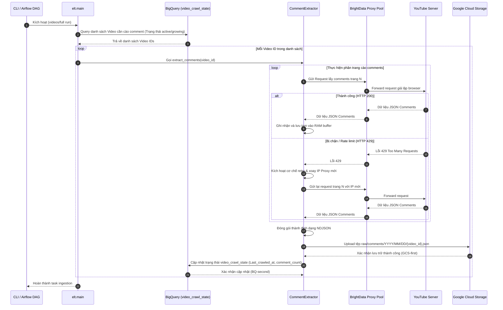

# Giai đoạn 1: Data Ingestion (Thu thập và Lưu trữ dữ liệu thô)

## 1. Tổng quan giai đoạn
Vai trò cốt lõi của Giai đoạn Ingestion là xây dựng một luồng thu thập dữ liệu tự động, ổn định hằng ngày đối với các thông tin video và bình luận trên YouTube mà **không bị giới hạn bởi YouTube API Quota** (10,000 units/ngày). Dữ liệu sau khi thu thập được tổ chức và lưu trữ an toàn dưới dạng hồ dữ liệu thô (Data Lake) trên Google Cloud Storage (GCS) theo cấu trúc ngày, đồng thời đồng bộ trạng thái vào BigQuery để phục vụ các bước xử lý tiếp theo.

---

## 2. Công nghệ sử dụng và Cấu trúc thư mục

### 2.1. Công nghệ sử dụng
* **Ngôn ngữ lập trình**: Python 3.13 (Môi trường Conda `etl-py313`)
* **Thư viện cào dữ liệu**:
  * `youtube-comment-downloader` (>= 0.1.78): Cào trực tiếp bình luận thông qua cơ chế giả lập trình duyệt, tiêu tốn 0 API quota.
  * `yt-dlp`: Trích xuất metadata của các video cũ lịch sử nhanh chóng.
  * YouTube Data API v3 `search.list`: Tìm video mới theo từng kênh cho Phase A, sau đó lọc keyword cục bộ.
* **Mạng Proxy**: BrightData Residential Proxy (Proxy dân cư xoay vòng IP tự động).
* **Lưu trữ & Tracking**:
  * Google Cloud Storage (GCS) Python SDK.
  * Google BigQuery Python SDK.

### 2.2. Cấu trúc thư mục liên quan
```text
Social_media_sentiment_pipeline/
├── schema/
│   └── layer_0_config/
│       └── init_config_tables.py ← Tạo config crawl, catalog sản phẩm và bảng tracking
├── elt/
│   ├── __init__.py
│   ├── main.py                  ← Điểm khởi chạy chính (Phase A, B, C)
│   ├── config.py                ← Đọc biến cấu hình từ .env
│   ├── extract/
│   │   ├── base_extractor.py    ← Lớp cha trừu tượng (Abstract Base Class)
│   │   ├── video_extractor.py   ← Cào metadata video qua API/yt-dlp
│   │   └── comment_extractor.py ← Cào bình luận qua youtube-comment-downloader
│   ├── datacontext/
│   │   └── gcs_client.py        ← Trình quản lý ghi tệp NDJSON lên GCS
│   ├── repositories/            ← Truy cập channel, keyword, crawl state và quota trong BigQuery
│   ├── seed_data/
│   │   ├── seed_channels.csv
│   │   ├── seed_keywords.csv
│   │   ├── seed_products.csv    ← Catalog chuẩn độc lập, 500 sản phẩm mẫu
│   │   └── seed_loader.py       ← Đồng bộ seed và template specs
│   └── quota_budget.py          ← Quản lý hạn mức và tiêu thụ API quota
```

---

## 3. Thành phần hoạt động chính và Cách sử dụng

### 3.1. Các thành phần hoạt động chính
1. **`QuotaBudget`**: Kiểm soát chặt chẽ dung lượng quota YouTube API v3 tiêu thụ. Nếu quota vượt quá 9,500 units trong ngày, hệ thống sẽ tự động dừng các cuộc gọi API và chuyển hẳn sang cơ chế offline/scraper.
2. **`VideoExtractor`**:
   * *Phase A (Daily Scan)*: Dùng YouTube API `search.list` theo từng kênh, giới hạn video mới trong 3 ngày gần nhất rồi lọc keyword cục bộ. Luồng này đã có implementation nhưng đang tạm comment trong `elt.main` khi chạy `videos/full`.
   * *Phase B (Historical Scan)*: Sử dụng `yt-dlp` quét toàn bộ lịch sử video của các kênh mới thêm vào hệ thống mà không gọi API.
3. **`CommentExtractor`**:
   * Chạy song song đa luồng cào bình luận từ danh sách video cần cập nhật.
   * Cấu hình chuyển đổi requests qua BrightData Proxy Pool. Nếu nhận tín hiệu HTTP `429` (Too Many Requests), module tự động bắt lỗi, sleep ngắn tăng dần (exponential backoff) và xoay IP Proxy mới để tiếp tục cào.
4. **`GCSClient`**: Chịu trách nhiệm ghi dữ liệu thô. Thay vì ghi file JSON đơn thuần, client chuyển đổi dữ liệu về dạng **NDJSON** (Newline Delimited JSON) để BigQuery dễ dàng đọc trực tiếp dưới dạng External Tables.
5. **`seed_loader`**: Đồng bộ channel, keyword dùng cho discovery, catalog sản phẩm chuẩn từ `seed_products.csv`, alias và template specs. `keyword_config` không còn là nguồn dữ liệu cho `dim_products`.

### 3.2. Cách sử dụng (Manual Command)
Khởi chạy quy trình cào dữ liệu thủ công thông qua CLI:
```powershell
# Chạy toàn bộ pipeline thu thập dữ liệu (Daily, Historical và Backlog)
conda activate etl-py313
python -m elt.main --mode full

# Chạy extraction video: Phase A hiện tạm tắt trong main, Phase B historical vẫn chạy
python -m elt.main --mode videos

# Chỉ chạy cào bình luận backlog cho các video chưa hoàn thành
python -m elt.main --mode comments
```

---

## 4. Tác nhân và Biểu đồ tuần tự (Sequence Diagram)

### 4.1. Tác nhân hoạt động
* **Người vận hành / Airflow Scheduler**: Kích hoạt pipeline thủ công hoặc theo lịch.
* **YouTube Platform**: Nguồn cấp dữ liệu (Metadata, RSS, Comments).
* **BrightData Proxy**: Hệ thống trung gian cung cấp IP xoay vòng.
* **Google Cloud Storage (GCS)**: Nơi lưu trữ tệp NDJSON thô cuối cùng.
* **BigQuery DB**: Nơi cập nhật log quota và trạng thái crawl của từng video.

### 4.2. Biểu đồ tuần tự luồng cào comment và lưu trữ
Biểu đồ dưới đây minh họa chi tiết quy trình cào dữ liệu bình luận từ video, cách xử lý lỗi rate-limit bằng BrightData Proxy, và lưu trữ dữ liệu theo nguyên lý GCS-first:



### 4.3. Trạng thái vận hành hiện tại

* Phase B historical và Phase C backlog đang được gọi trong `elt.main`.
* Phase A daily đã có code `search.list` nhưng đang tạm comment trong entry point; cần bật lại sau khi xác nhận quota và dữ liệu seed production.
* Airflow DAG tồn tại để orchestration, nhưng giai đoạn development ưu tiên chạy thủ công trong Conda `etl-py313`.
