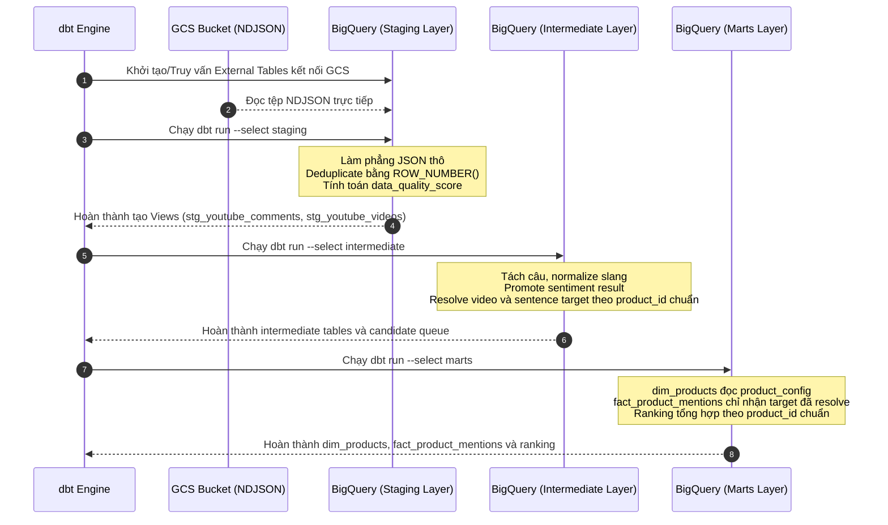

# Giai đoạn 2: Data Transformation (Tiền xử lý và Biến đổi dữ liệu với dbt)

## 1. Tổng quan giai đoạn
Dữ liệu thô lưu trên Google Cloud Storage (NDJSON) là dữ liệu phi cấu trúc, chứa nhiều nhiễu (spam quảng cáo, teencode, viết tắt, ký tự đặc biệt, emoji, bình luận phi tiếng Việt). Tác dụng của Giai đoạn 2 là làm sạch, cấu trúc hóa dữ liệu, chuẩn hóa target sản phẩm và tạo marts sẵn sàng cho phân tích. Catalog sản phẩm được quản lý riêng trong `product_config`; `keyword_config` chỉ phục vụ discovery video.

---

## 2. Công nghệ sử dụng và Cấu trúc thư mục

### 2.1. Công nghệ sử dụng
* **Công cụ biến đổi**: `dbt-bigquery` (dbt version >= 1.7.0). Toàn bộ phép tính toán biến đổi dữ liệu được đẩy thẳng xuống BigQuery để xử lý song song (in-database processing).
* **Ngôn ngữ**: SQL (BigQuery Standard SQL dialect) kết hợp Javascript UDF (User Defined Functions) nhúng trực tiếp trong SQL.
* **Cơ chế nạp**: BigQuery External Tables (kết nối trực tiếp tệp NDJSON từ GCS mà không tốn phí nạp).

### 2.2. Cấu trúc thư mục dbt liên quan
```text
Social_media_sentiment_pipeline/
├── transform/
│   ├── dbt_project.yml          ← Cấu hình tổng thể dự án dbt
│   ├── profiles.yml             ← Cấu hình kết nối BigQuery (location: asia-southeast1)
│   ├── seeds/
│   │   └── vn_slang_dictionary.csv ← Từ điển teencode, tiếng lóng tiếng Việt
│   ├── models/
│   │   ├── staging/
│   │   │   ├── sources.yml      ← Định nghĩa nguồn dữ liệu thô từ BigQuery External Tables
│   │   │   ├── stg_youtube_comments.sql ← Làm phẳng và chấm điểm chất lượng bình luận
│   │   │   └── stg_youtube_videos.sql   ← Làm phẳng metadata video
│   │   ├── intermediate/
│   │   │   ├── int_comment_sentences.sql             ← Tách câu và chuẩn hóa teencode tiếng Việt
│   │   │   ├── int_sentiment_results.sql             ← Bảng đệm nhận kết quả từ NLP Pipeline
│   │   │   ├── int_video_product_mentions.sql        ← Resolve model trong title/description bằng alias
│   │   │   ├── int_sentence_product_targets.sql      ← Gán target explicit hoặc kế thừa primary video
│   │   │   └── int_product_resolution_candidates.sql ← Hàng chờ target mơ hồ cho LLM/Admin
│   │   └── marts/
│   │       ├── dim_products.sql              ← Danh mục sản phẩm hoạt động
│   │       ├── fact_product_mentions.sql     ← Bảng sự kiện chi tiết cảm xúc khía cạnh sản phẩm
│   │       └── agg_daily_product_ranking.sql ← Bảng xếp hạng Bayesian và Controversy index
```

---

## 3. Thành phần hoạt động chính và Cách sử dụng

### 3.1. Các thành phần hoạt động chính
1. **Thuật toán Chấm điểm Chất lượng Dữ liệu (`data_quality_score`)**:
   Chạy tại lớp Staging (`stg_youtube_comments`). Mỗi bình luận thô xuất phát với điểm tối đa là `1.0`. Hệ thống trừ điểm dựa trên 3 tiêu chí:
   * Chứa URL quảng cáo: trừ `0.5` điểm.
   * Quá ngắn (ít hơn 5 ký tự): trừ `0.3` điểm.
   * Chỉ chứa emoji hoặc ký tự đặc biệt, không có chữ hay số: trừ `0.5` điểm.
   * Công thức: `GREATEST(0.0, 1.0 - url_penalty - short_penalty - non_alpha_penalty)`. Câu có điểm $\ge 0.8$ mới được đi tiếp.
2. **Cơ chế tách câu (Sentence Segmentation)**:
   Tại lớp Intermediate (`int_comment_sentences`), hệ thống sử dụng Native SQL để chia tách bình luận dài thành nhiều câu ngắn độc lập dựa trên dấu ngắt câu (`.`, `!`, `?`, `\n`) bằng cách chèn dấu phân tách `|` rồi chạy `UNNEST(SPLIT(...))`. Điều này tăng tốc độ xử lý gấp nhiều lần so với sử dụng thư viện Python hay JS bên ngoài.
3. **UDF Chuẩn hóa Từ lóng và Teencode (`replace_slang`)**:
   Nhúng một hàm Javascript UDF vào đầu model `int_comment_sentences`. UDF này tự động tải mảng từ điển slang từ seed `vn_slang_dictionary` lên bộ nhớ đệm, tự động biên dịch một biểu thức RegExp lớn dựa trên các biên từ tiếng Việt (word boundaries) để thay thế chính xác các từ viết tắt viết sai (ví dụ: `ko/k` -> `không`, `cam` -> `camera`, `sdt` -> `số điện thoại`) mà không làm hỏng cấu trúc từ thường.
4. **Product Target Resolution**:
   * `int_video_product_mentions` match `product_aliases` trong title và description để xác định `primary|secondary`.
   * `int_sentence_product_targets` gán comment nêu model trực tiếp hoặc kế thừa `primary` khi video review đơn.
   * Comment ngầm trong video so sánh và target chưa rõ được chuyển sang `int_product_resolution_candidates`, chưa tham gia KPI cho tới khi LLM/Admin resolve.
5. **dbt Seeds & Tests**:
   Nạp dữ liệu từ điển tự động qua dbt seed. Áp dụng dbt test hằng ngày để kiểm tra tính toàn vẹn dữ liệu: ràng buộc `not_null` cho khóa chính, `unique` cho `sentence_id`, và kiểm tra quan hệ khóa ngoại.

### 3.2. Cách sử dụng (Manual Command)
Chạy biến đổi dữ liệu dbt thủ công từ Windows Command Line hoặc PowerShell:
```powershell
# Di chuyển vào thư mục dbt và thực thi
cd transform

# Chạy nạp các file seed CSV trước
dbt seed

# Chạy toàn bộ các model biến đổi
dbt run

# Chạy kiểm thử chất lượng dữ liệu
dbt test

# Xuất tài liệu lineage graph trực quan và khởi động web server hiển thị
dbt docs generate
dbt docs serve
```
Hoặc chạy thông qua file shortcut script ở thư mục gốc:
```powershell
.\run_dbt.bat
```

Với candidate mơ hồ, chạy resolver giữa hai lượt dbt:

```powershell
conda activate etl-py313
python -m nlp.product_target_resolver --limit 100
```

---

## 4. Tác nhân và Biểu đồ tuần tự (Sequence Diagram)

### 4.1. Tác nhân hoạt động
* **Airflow DAG (dbt task)** hoặc **Người vận hành (CLI)**: Kích hoạt dbt run.
* **dbt Engine**: Trình biên dịch SQL, quản lý thứ tự chạy model dựa trên hàm `ref()`.
* **Google BigQuery**: Công cụ xử lý và lưu trữ dữ liệu vật lý (Staging, Intermediate, Marts).

### 4.2. Biểu đồ tuần tự luồng biến đổi dữ liệu ELT
Biểu đồ thể hiện cách dữ liệu đi qua 3 tầng lưu trữ của dbt trong lòng BigQuery:


