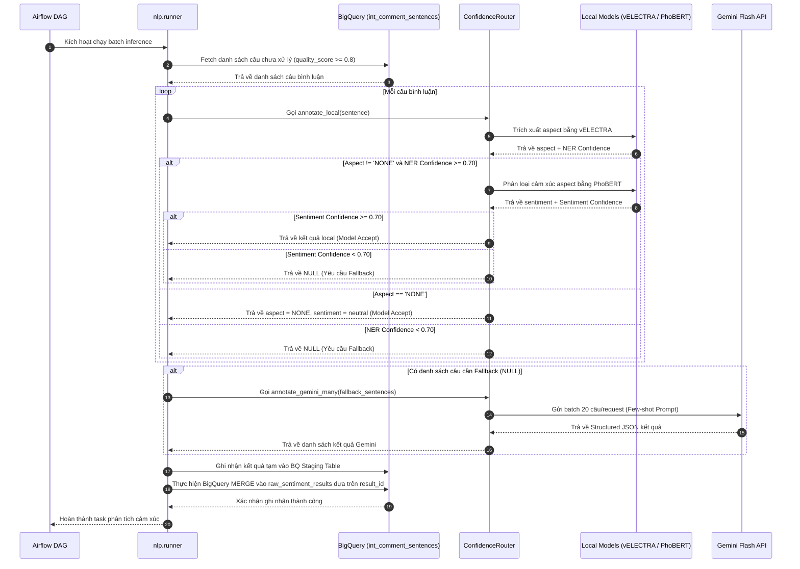
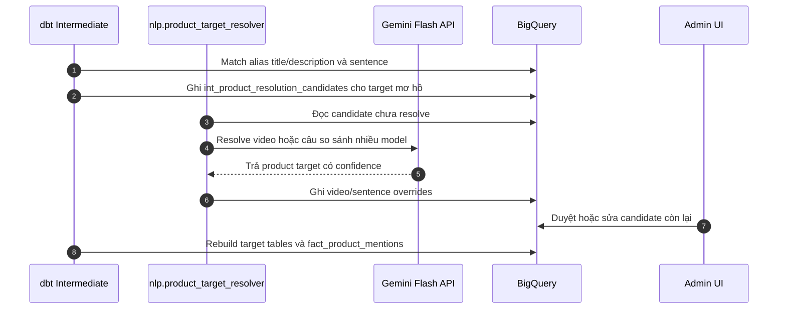

# Giai đoạn 3: NLP Hybrid Pipeline (Hệ thống Xử lý Ngôn ngữ Tự nhiên lai)

## 1. Tổng quan giai đoạn
Tác dụng của Giai đoạn 3 là trích xuất khía cạnh sản phẩm công nghệ (Aspect Extraction) và phân loại cảm xúc tương ứng (Sentiment Classification) từ các câu bình luận đã được làm sạch ở Phase 2. Để tối ưu hóa độ chính xác và chi phí vận hành, hệ thống sử dụng **kiến trúc NLP Hybrid (lai)**:
* Chạy suy luận cục bộ bằng các mô hình học sâu nhỏ đã được fine-tune tối ưu cho tiếng Việt (vELECTRA và PhoBERT).
* Sử dụng **Confidence Routing** để tự động chuyển tiếp (fallback) các câu mơ hồ, châm biếm có độ tin cậy thấp lên Gemini Flash API.
* Resolve sản phẩm thực sự được đánh giá theo alias trước, LLM fallback sau; các target chưa chắc chắn được đưa vào hàng chờ để Admin xử lý.

---

## 2. Công nghệ sử dụng và Cấu trúc thư mục

### 2.1. Công nghệ sử dụng
* **Mô hình Trích xuất Khía cạnh (Aspect Extraction)**: Mô hình Token Classification fine-tuned từ `vielectra-base-discriminator` (nhận diện 6 aspect: Pin, Camera, Màn hình, Hiệu năng, Thiết kế, Giá theo cấu trúc nhãn NER BIO).
* **Mô hình Phân loại Cảm xúc (Sentiment Classification)**: Mô hình Sequence Classification fine-tuned từ `phobert-base-v2` (phân loại 3 lớp: Tích cực, Tiêu cực, Trung lập).
* **Thư viện chính**: PyTorch, HuggingFace Transformers, `seqeval` (NER metrics), `underthesea` (word segmentation cho vELECTRA), `pyvi` (word segmentation cho PhoBERT).
* **Trí tuệ nhân tạo thế hệ mới**: Gemini Flash API (phục vụ tự động gán nhãn, sentiment fallback và resolve target mơ hồ).
* **Lưu trữ kết quả**: Google BigQuery (ghi nhận batch qua BQ MERGE upsert).

### 2.2. Cấu trúc thư mục NLP
```text
Social_media_sentiment_pipeline/
├── models/
│   ├── velectra_aspect/          ← Thư mục chứa weights vELECTRA local sau fine-tune
│   └── phobert_sentiment/        ← Thư mục chứa weights PhoBERT local sau fine-tune
├── nlp/
│   ├── __init__.py
│   ├── config.py                 ← Cấu hình thông số NLP (Threshold 0.70, batch sizes)
│   ├── runner.py                 ← Runner chính chạy batch inference hằng ngày
│   ├── product_target_resolver.py← Giải quyết tên sản phẩm thực tế trong câu
│   ├── training/
│   │   ├── prepare_dataset_v2.py ← Làm sạch, trộn nhãn NONE, chia Train/Val (no overlap)
│   │   ├── upload_to_drive.py    ← Tiện ích đẩy model weights lên Google Drive
│   │   └── Colab_Finetuning_Template.ipynb ← Notebook dùng để training trên Colab GPU T4
│   ├── annotation/
│   │   ├── gemini_annotator.py   ← Trình gọi Gemini API có cơ chế kiểm soát rate limit
│   │   └── prompt_builder.py     ← Xây dựng template few-shot prompts gán nhãn
│   └── inference/
│       ├── confidence_router.py  ← Đầu não điều phối Confidence Routing
│       ├── velectra_extractor.py ← Wrapper chạy mô hình vELECTRA trích xuất khía cạnh
│       └── phobert_classifier.py ← Wrapper chạy mô hình PhoBERT phân loại cảm xúc
```

---

## 3. Thành phần hoạt động chính và Cách sử dụng

### 3.1. Các thành phần hoạt động chính
1. **`ConfidenceRouter`**:
   * Nhận câu bình luận $\rightarrow$ Gọi `VELECTRAExtractor` trích xuất các aspect tiềm năng kèm độ tin cậy thực thể ($C_{ner}$).
   * Nếu phát hiện aspect thật, cắt phân đoạn chứa aspect đó (segment) và ghép thành định dạng `aspect </s> sentence` gửi sang `PhoBERTClassifier` phân loại cảm xúc thu về độ tin cậy phân lớp ($C_{sent}$).
   * Kiểm tra điều kiện: Nếu $\min(C_{ner}, C_{sent}) \ge 0.70$, lưu kết quả cục bộ. Nếu dưới $0.70$, đánh dấu câu này chuyển sang `GeminiAnnotator` làm fallback.
   * Nếu câu không chứa khía cạnh nào (O tag từ NER), mặc định ghi nhận nhãn aspect là `NONE` và cảm xúc là `neutral` mà không gọi mô hình cảm xúc (local accept nhanh).
2. **`GeminiAnnotator`**:
   * Đóng gói các câu bị lỗi tự tin thấp gửi hàng loạt (batch size = 20) lên Gemini Flash API để lấy cấu trúc JSON chuẩn: `aspect_label`, `segment_text`, `sentiment_label`, và `explanation` (lý do phân loại).
   * Tích hợp lớp `_DailyBudget` để theo dõi và khống chế hạn mức gọi API trong ngày tránh lỗi `429` (cooldown block 70 giây khi nhận mã lỗi).
3. **`nlp.runner`**:
   * Thực hiện truy vấn các câu chưa xử lý từ BigQuery (`is_vietnamese = True`, `data_quality_score >= 0.8`, độ dài từ 2 đến 80 từ).
   * Chạy song song suy luận, đóng gói dữ liệu và thực hiện ghi đè BigQuery thông qua cấu trúc MERGE SQL tránh trùng lặp bản ghi.
4. **`nlp.product_target_resolver`**:
   * Đọc candidate do dbt tạo khi title, description hoặc câu comment không thể map chắc chắn bằng alias.
   * Gọi LLM fallback cho video chưa rõ sản phẩm và câu so sánh nhiều model.
   * Ghi kết quả override để dbt rebuild `int_video_product_mentions`, `int_sentence_product_targets` và `fact_product_mentions`.

### 3.2. Cách sử dụng (Manual Command)
Chạy suy luận NLP hàng loạt trên máy local:
```powershell
conda activate etl-py313

# Chạy inference cho 500 câu bình luận mới nhất và ghi vào BigQuery
python -m nlp.runner --limit 500

# Chạy thử nghiệm chế độ Dry-run không ghi DB, chỉ xuất file JSON kết quả
python -m nlp.runner --limit 100 --no-write-bq --output-jsonl scratch/dry_run_results.jsonl

# Chạy phân tích thử nghiệm phân phối tin cậy của mô hình local (Local Debug)
python -m nlp.runner --limit 500 --debug-local-confidence --output-jsonl scratch/local_confidence_debug.jsonl

# Cho phép reprocess và cập nhật đè kết quả cũ trong BigQuery
python -m nlp.runner --limit 1000 --reprocess

# Resolve target sản phẩm mơ hồ sau lượt dbt intermediate đầu tiên
python -m nlp.product_target_resolver --limit 100
```

---

## 4. Tác nhân và Biểu đồ tuần tự (Sequence Diagram)

### 4.1. Tác nhân hoạt động
* **Airflow DAG (sentiment_analysis_dag)**: Lập lịch chạy runner tự động.
* **NLP Runner**: Điều phối nạp dữ liệu và ghi kết quả BigQuery.
* **Confidence Router**: Đầu não kiểm soát định tuyến cục bộ/đám mây.
* **vELECTRA & PhoBERT Models**: Mô hình chạy offline trên phần cứng máy.
* **Gemini Flash API**: Hệ thống LLM đám mây làm fallback cho sentiment và target sản phẩm.
* **BigQuery Database**: Lưu trữ dữ liệu cảm xúc chi tiết (`raw_sentiment_results`).

### 4.2. Biểu đồ tuần tự luồng suy luận NLP và Fallback
Biểu đồ thể hiện cách một batch câu bình luận được phân tích, định tuyến tin cậy và MERGE vào cơ sở dữ liệu:



### 4.3. Luồng resolve sản phẩm được đánh giá


