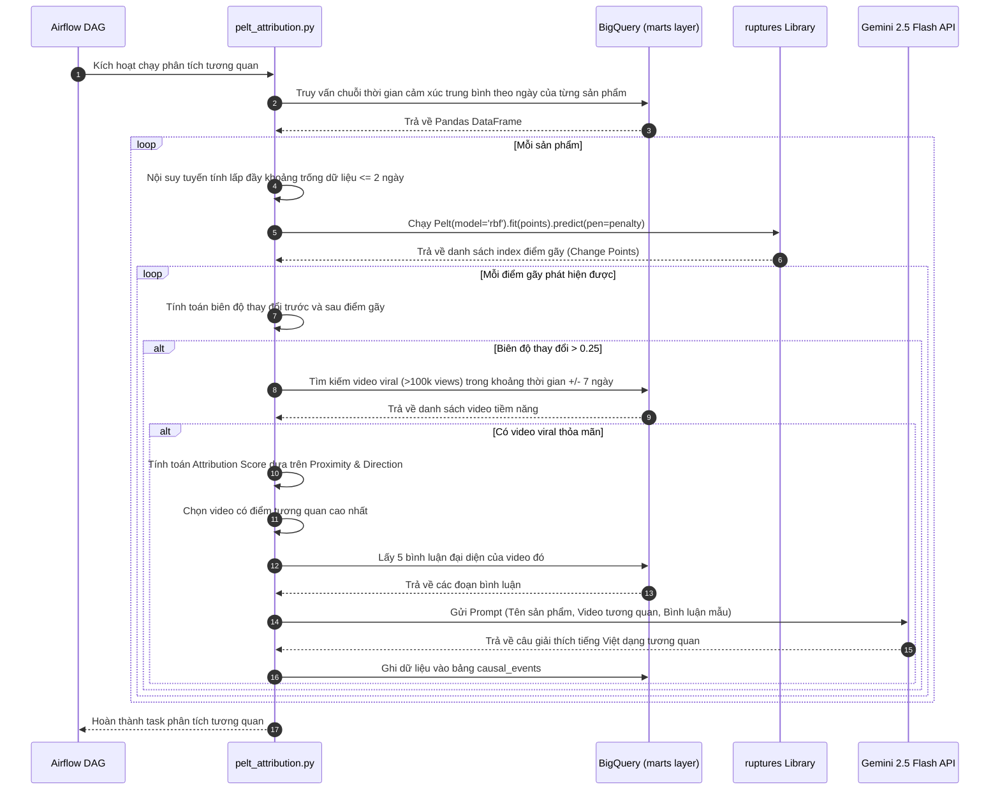

# Giai đoạn 4: Analytics Engine (Động cơ phân tích chuyên sâu)

## 1. Tổng quan giai đoạn
Tác dụng cốt lõi của Giai đoạn 4 là khai phá các giá trị phân tích sâu sắc từ chuỗi dữ liệu cảm xúc của người dùng, phân biệt hệ thống này với các công cụ phân loại cảm xúc thô sơ. Phase 4 cung cấp 3 mô hình phân tích chính:
1. **Bayesian Sentiment Ranking**: Sắp xếp thứ hạng sản phẩm dựa trên cả số lượng nhắc đến và phân phối cảm xúc, loại bỏ các sai số do mẫu dữ liệu nhỏ.
2. **Controversy Index**: Đo lường và đánh nhãn mức độ bất đồng ý kiến của cộng đồng đối với sản phẩm.
3. **Correlation Attribution Engine**: Tự động phát hiện các ngày xảy ra thay đổi cảm xúc đột ngột thông qua thuật toán dò tìm điểm gãy chuỗi thời gian, tính toán điểm tương quan để gán sự kiện với video YouTube viral gây ảnh hưởng lớn nhất, và dùng Gemini sinh lời giải thích tự nhiên.

Toàn bộ ranking và time series được tổng hợp theo `product_id` chuẩn từ `product_config` thông qua `dim_products` và `fact_product_mentions`. Keyword crawl không còn được xem là sản phẩm.

---

## 2. Công nghệ sử dụng và Cấu trúc thư mục

### 2.1. Công nghệ sử dụng
* **Công cụ phân tích SQL**: BigQuery Analytic SQL (STDDEV_POP, AVG, COUNT, LAG, PARTITION BY, WINDOW).
* **Phát hiện điểm gãy chuỗi thời gian**: Thư viện Python `ruptures` (Sử dụng thuật toán PELT - Pruned Exact Linear Time với mô hình phi tuyến RBF - Radial Basis Function).
* **Xử lý số liệu**: Pandas, NumPy, Scikit-learn.
* **Mô tả tương quan tự nhiên**: Gemini 2.5 Flash API (truy vấn 5 bình luận tiêu biểu nhất của video tương quan để giải thích ngữ cảnh tiếng Việt).
* **Quản lý dữ liệu**: dbt (marts layer).

### 2.2. Cấu trúc thư mục Analytics
```text
Social_media_sentiment_pipeline/
├── transform/models/marts/
│   └── agg_daily_product_ranking.sql ← Tính toán Bayesian Ranking & Controversy Index bằng dbt SQL
├── analytics/
│   ├── __init__.py
│   ├── bayesian_ranking.py           ← Tiện ích kích hoạt dbt model trên BigQuery
│   ├── controversy_index.py          ← Tiện ích kích hoạt dbt model trên BigQuery
│   └── pelt_attribution.py           ← Logic lõi phát hiện điểm gãy, tính tương quan và sinh giải thích
├── tests/test_analytics/
│   └── test_pelt_attribution.py     ← Các bài kiểm thử đơn vị cho Attribution Engine
```

---

## 3. Thành phần hoạt động chính và Cách sử dụng

### 3.1. Các thành phần hoạt động chính
1. **Bayesian Sentiment Ranking Model**:
   * Công thức: $S_B = \frac{C \cdot m + \sum w_i s_i}{C + n}$
   * Hệ số $C = 50.0$ đóng vai trò "prior strength" (độ mạnh tiên nghiệm).
   * Mức trung bình tiên nghiệm $m$ được tính bằng giá trị cảm xúc trung bình toàn cầu của tất cả sản phẩm trong chuỗi cửa sổ 30 ngày gần nhất.
   * Kết quả giúp sản phẩm ít lượt nhắc đến bị kéo điểm về mức trung lập ($0.0$), tránh đứng đầu bảng vô lý.
   * Chỉ nhận mention đã resolve target sản phẩm; aspect `NONE` bị loại khỏi KPI.
2. **Controversy Index Model**:
   * Công thức: $CI = \frac{\sigma_s}{\mu_s + 0.1}$
   * Độ lệch chuẩn $\sigma_s$ thể hiện sự phân tán ý kiến. Giá trị trung bình tuyệt đối $\mu_s$ thể hiện sự đồng thuận một hướng.
   * Nếu cộng đồng vừa cực kỳ khen vừa cực kỳ chê, $\sigma_s$ sẽ cao và $\mu_s$ gần bằng $0$, làm chỉ số $CI$ vọt lên rất lớn (Controversy label: `cao` - màu đỏ).
3. **Correlation Attribution Engine (`PELTAttribution`)**:
   * *Bước 1*: Nội suy tuyến tính chuỗi thời gian cảm xúc ngày của sản phẩm (cho phép lấp đầy các khoảng trống dữ liệu tối đa 2 ngày).
   * *Bước 2*: Chạy thuật toán PELT để tìm danh sách điểm gãy (Change Points). Chỉ giữ lại các điểm có biên độ thay đổi cảm xúc trung bình trước và sau điểm gãy lớn hơn `0.25`.
   * *Bước 3*: Với mỗi điểm gãy, tìm các video thuộc sản phẩm có số lượt xem $> 100,000$ đăng trong vòng $\pm 7$ ngày.
   * *Bước 4*: Tính toán `attribution_score = proximity * 0.5 + direction_alignment * 0.5` để chọn ra video tương quan nhất.
   * *Bước 5*: Gọi Gemini Flash API tóm tắt ngữ cảnh từ video và 5 bình luận tiêu biểu để sinh 2-3 câu giải thích tự nhiên ghi vào bảng `causal_events`.

### 3.2. Trạng thái tương thích product catalog

`agg_daily_product_ranking` và phần time series của `PELTAttribution` đã đọc `fact_product_mentions` theo `product_id` chuẩn. Riêng truy vấn chọn video viral trong `PELTAttribution._query_videos_in_window()` vẫn còn điều kiện legacy `video_crawl_state.keyword_id = product_id`; cần chuyển sang join `int_video_product_mentions` trước khi rebuild causal events production.

### 3.3. Cách sử dụng (Manual Command)
Chạy động cơ phân tích và gán tương quan nguyên nhân bằng Python CLI:
```powershell
conda activate etl-py313

# Chạy tính toán gán tương quan nguyên nhân cho toàn bộ sản phẩm
python -m analytics.pelt_attribution

# Chạy thử nghiệm Dry-run (chỉ hiển thị log, không ghi vào BigQuery)
python -m analytics.pelt_attribution --dry-run

# Chạy với các tham số thuật toán tùy chỉnh
# --penalty: Độ phạt của thuật toán PELT (mặc định 3.0, số càng nhỏ phát hiện càng nhiều điểm gãy)
# --amplitude: Ngưỡng biên độ thay đổi cảm xúc tối thiểu để chấp nhận điểm gãy (mặc định 0.25)
python -m analytics.pelt_attribution --penalty 4.0 --amplitude 0.30
```

---

## 4. Tác nhân và Biểu đồ tuần tự (Sequence Diagram)

### 4.1. Tác nhân hoạt động
* **Airflow DAG (analytics_dag)**: Lập lịch chạy hằng ngày.
* **PELT Attribution Module**: Mã Python quản lý luồng tính toán chuỗi thời gian.
* **ruptures Library**: Công cụ toán học chạy giải thuật PELT.
* **Gemini 2.5 Flash API**: Sinh câu giải thích tiếng Việt.
* **BigQuery Database**: Cung cấp dữ liệu `fact_product_mentions` và lưu trữ `causal_events`.

### 4.2. Biểu đồ tuần tự luồng phân tích tương quan
Biểu đồ thể hiện cách chuỗi dữ liệu thời gian được phân tích để tìm kiếm và gán lỗi tương quan nguyên nhân:


