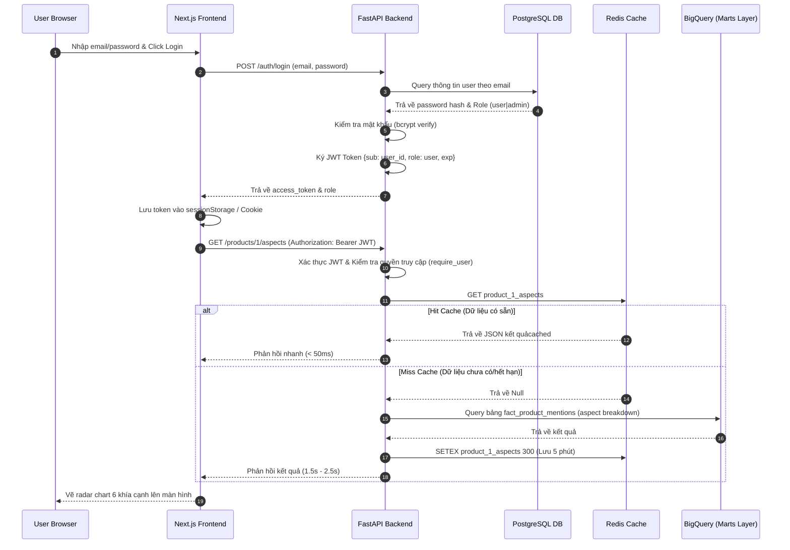
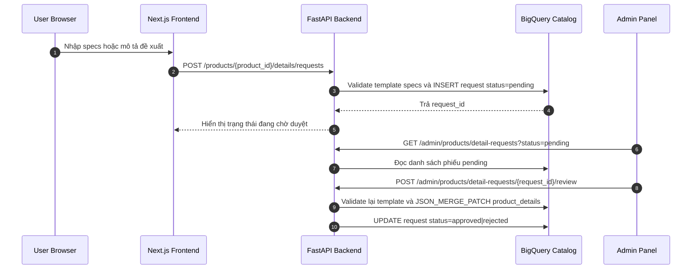
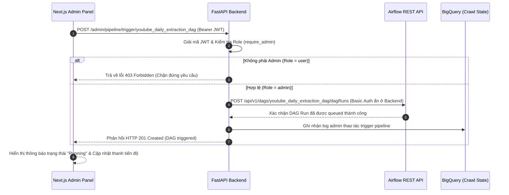

# Giai đoạn 5: Web Application & RBAC (Ứng dụng Web và Phân quyền)

## 1. Tổng quan giai đoạn
Tác dụng của Giai đoạn 5 là xây dựng giao diện tương tác người dùng cuối (Frontend) và cổng kết nối API bảo mật (Backend). Hệ thống phân tách rõ ràng hai đối tượng sử dụng (Role-Based Access Control - RBAC):
1. **Guest/User**: Có thể đăng ký, đăng nhập, tìm kiếm/lọc sản phẩm, xem bảng xếp hạng Bayesian, biểu đồ radar 6 khía cạnh, timeline attribution và thông số kỹ thuật. User đăng nhập được gửi phiếu đề xuất bổ sung thông tin sản phẩm.
2. **Admin**: Kế thừa toàn bộ quyền của User, đồng thời quản lý keyword/kênh crawl, catalog sản phẩm, alias, template specs, mapping video, candidate chưa resolve và phiếu chỉnh sửa thông tin trước khi công bố.

---

## 2. Công nghệ sử dụng và Cấu trúc thư mục

### 2.1. Công nghệ sử dụng
* **Backend API**: FastAPI (Python 3.13), Uvicorn ASGI Server.
* **Xác thực & Phân quyền**: JWT (JSON Web Tokens), `passlib` (bcrypt) để băm mật khẩu, Dependency Injection kiểm tra role (`admin` vs `user`).
* **Cơ sở dữ liệu Auth**: PostgreSQL (sử dụng SQLAlchemy ORM làm transactional store lưu tài khoản; tránh dùng BigQuery).
* **Caching**: Redis (Cache kết quả truy vấn BigQuery marts trong 300 giây giúp tăng tốc độ phản hồi dưới 2 giây).
* **Frontend**: Next.js 14+ (App Router, TypeScript).
* **Giao diện & Biểu đồ**: Tailwind CSS, shadcn/ui components, Recharts (Radar chart, Line chart).
* **Điều phối & Giám sát**: Airflow REST API integration.

### 2.2. Cấu trúc thư mục Web Application
```text
Social_media_sentiment_pipeline/
├── api/
│   ├── main.py              ← Điểm khởi chạy FastAPI, cấu hình CORS & Middleware
│   ├── config.py            ← Settings đọc biến môi trường từ .env
│   ├── auth.py              ← Core hàm băm mật khẩu, tạo và kiểm tra tính hợp lệ JWT
│   ├── database.py          ← Khởi tạo SQLAlchemy engine kết nối PostgreSQL
│   ├── models.py            ← Định nghĩa bảng AppUser lưu thông tin tài khoản và Role
│   ├── dependencies.py      ← Injection kiểm tra JWT (`get_current_user`, `require_admin`)
│   ├── seed_admin.py        ← Tiện ích tạo nhanh các tài khoản demo (Admin & User)
│   ├── bq_client.py         ← Client BigQuery chuyên dùng cho Web App
│   ├── cache.py             ← Tiện ích kết nối Redis cache
│   └── routers/
│       ├── auth.py          ← Đăng ký, đăng nhập, đăng xuất, lấy thông tin cá nhân
│       ├── products.py      ← API đọc bảng xếp hạng, khía cạnh radar, causal events
│       ├── search.py        ← API tìm kiếm và lọc sản phẩm
│       ├── admin.py         ← API CRUD kênh và từ khóa trực tiếp xuống BigQuery
│       ├── product_catalog.py ← API CRUD catalog, alias/template, candidate, mapping và duyệt phiếu
│       └── pipeline.py      ← API Proxy kết nối giám sát Airflow REST API
├── frontend/
│   ├── package.json
│   ├── tsconfig.json
│   ├── app/
│   │   ├── layout.tsx       ← Bọc Providers (Auth, Theme)
│   │   ├── page.tsx         ← Trang chủ điều hướng thông minh theo session
│   │   ├── (auth)/          ← login/, register/ (Màn hình đăng nhập, đăng ký)
│   │   ├── (app)/           ← dashboard/ và admin/ cần đăng nhập
│   │   ├── (public)/        ← analytics/search, top-products, products/[id]
│   │   └── globals.css      ← Vanilla CSS kết hợp Tailwind
│   ├── components/
│   │   ├── layout/          ← Sidebar, Header dùng chung
│   │   ├── dashboard/       ← Các Dashboard nhỏ tương ứng với Role
│   │   └── shared/          ← Các badges, bảng biểu dùng chung
│   └── lib/
│       ├── api-client.ts    ← SDK axios gọi API Backend
│       ├── auth-context.tsx ← Quản lý Session Context trên Frontend
│       └── types.ts         ← Định nghĩa kiểu TypeScript
```

---

## 3. Thành phần hoạt động chính và Cách sử dụng

### 3.1. Các thành phần hoạt động chính
1. **Lớp bảo vệ RBAC (FastAPI Dependencies)**:
   * Mọi endpoint quản trị hoặc giám sát hệ thống đều được cấu hình kiểm tra phân quyền bằng middleware `require_admin`. Nếu access token giải mã ra role không phải `admin`, hệ thống chặn đứng yêu cầu và trả mã lỗi `403 Forbidden` trước khi chạy bất kỳ câu lệnh BigQuery hay Airflow nào.
2. **Redis Cache Layer**:
   * API endpoints đọc dữ liệu marts BigQuery được bọc qua Redis caching. Khi Client gọi API, hệ thống kiểm tra cache trước bằng Redis `GET`. Nếu hit cache $\rightarrow$ trả kết quả ngay lập tức ($<50\text{ms}$). Nếu miss $\rightarrow$ truy vấn BigQuery, ghi cache bằng Redis `SETEX` kèm thời gian hết hạn (TTL) 5 phút, trả kết quả ($1.5-2.5\text{s}$).
3. **Airflow Proxy Gateway**:
   * Cho phép Admin điều khiển Airflow thông qua các API an toàn được proxy qua FastAPI. Frontend gửi yêu cầu trigger DAG $\rightarrow$ FastAPI xác thực quyền admin $\rightarrow$ FastAPI chèn mã hóa gọi REST API nội bộ của Airflow `/api/v1/dags/.../dagRuns` $\rightarrow$ Trả kết quả trạng thái về cho Admin Dashboard. Điều này bảo vệ an toàn cho thông tin xác thực (Credentials) của Airflow.
4. **Product Catalog & Moderation**:
   * Ranking join `dim_products` để hiển thị tên model đầy đủ thay cho keyword crawl.
   * Trang chi tiết đọc `product_details` và `product_spec_templates`; specs được phép để trống.
   * User gửi đề xuất qua `POST /products/{product_id}/details/requests`. API validate key và kiểu dữ liệu specs theo template category.
   * Admin duyệt hoặc từ chối phiếu tại `/admin/products/detail-requests/{request_id}/review`. Phiếu được duyệt merge field mới vào `product_details`, không xóa field cũ không được đề cập.

### 3.2. Cách sử dụng (Manual Command)
Khởi chạy hệ thống Web Application cục bộ:
```powershell
conda activate etl-py313

# 1. Khởi động FastAPI Backend (chạy tại port 8000)
uvicorn api.main:app --host 0.0.0.0 --port 8000 --reload

# 2. Seed tài khoản thử nghiệm (Admin & User) - Chỉ cần chạy một lần duy nhất
python -m api.seed_admin

# 3. Khởi động Next.js Frontend (chạy tại port 3000)
cd frontend
npm install   # Cài đặt dependencies (chỉ lần đầu)
npm run dev
```
Tài khoản mặc định sau khi seed thành công:
* **Admin**: Email: `admin@example.com` | Mật khẩu: `admin1234`
* **User thường**: Email: `user@example.com` | Mật khẩu: `user1234`

---

## 4. Tác nhân và Biểu đồ tuần tự (Sequence Diagram)

### 4.1. Tác nhân hoạt động
* **User/Admin (Trình duyệt)**: Tương tác với giao diện Next.js.
* **Next.js Frontend**: Gửi các HTTP Request JWT an toàn đến Backend.
* **FastAPI Backend**: Đón nhận, phân quyền RBAC và điều khiển luồng.
* **Redis Cache**: Lưu trữ bộ nhớ đệm.
* **PostgreSQL Database**: Quản lý thông tin tài khoản người dùng.
* **BigQuery DW / Airflow Server**: Nguồn dữ liệu marts và điều phối nghiệp vụ.

### 4.2. Biểu đồ tuần tự
#### Luồng 1: Xác thực Đăng nhập & Lấy dữ liệu Phân tích (Có Caching)
Biểu đồ thể hiện quá trình đăng nhập và tải trang chi tiết sản phẩm tối ưu qua Redis Cache:



#### Luồng 2: User gửi phiếu và Admin duyệt thông tin sản phẩm



### 4.3. API catalog hiện có

```text
GET    /products/top/{category}
GET    /products/{product_id}/aspects
GET    /products/{product_id}/attribution
POST   /products/{product_id}/details/requests

GET|POST|PUT|DELETE /admin/products
GET|POST|DELETE     /admin/products/aliases
GET|POST|DELETE     /admin/products/templates
GET                 /admin/products/detail-requests
POST                /admin/products/detail-requests/{request_id}/review
GET|PUT              /admin/products/video-mappings
GET|POST             /admin/products/resolution-candidates
```

### 4.4. Luồng Admin Trigger DAG điều phối thông qua Proxy an toàn
Biểu đồ minh họa quy trình Admin kích hoạt chạy lại pipeline từ bảng điều khiển Next.js:


