# Sequence Diagram Các Chức Năng Chính

Tài liệu này mô tả các luồng tuần tự quan trọng của `Social Media Sentiment Pipeline`.
Các sơ đồ dùng Mermaid `sequenceDiagram`, theme trắng đen, và các nhánh xử lý được đặt trong khung `alt` theo điều kiện nghiệp vụ.

## 1. Khởi Tạo Schema Và Seed Cấu Hình

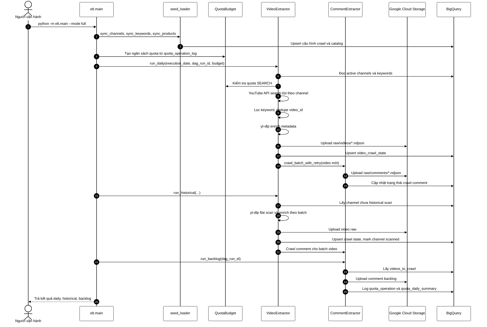

## 2. ELT Full Pipeline

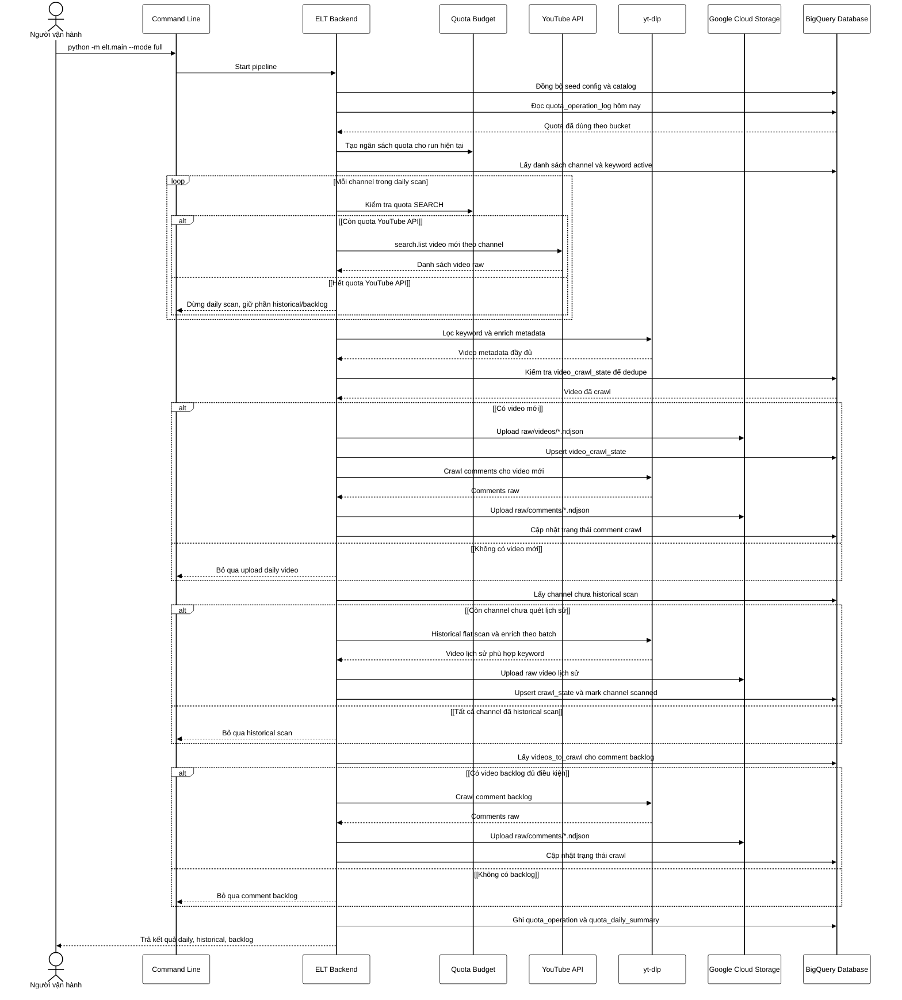

## 3. Daily Scan Video

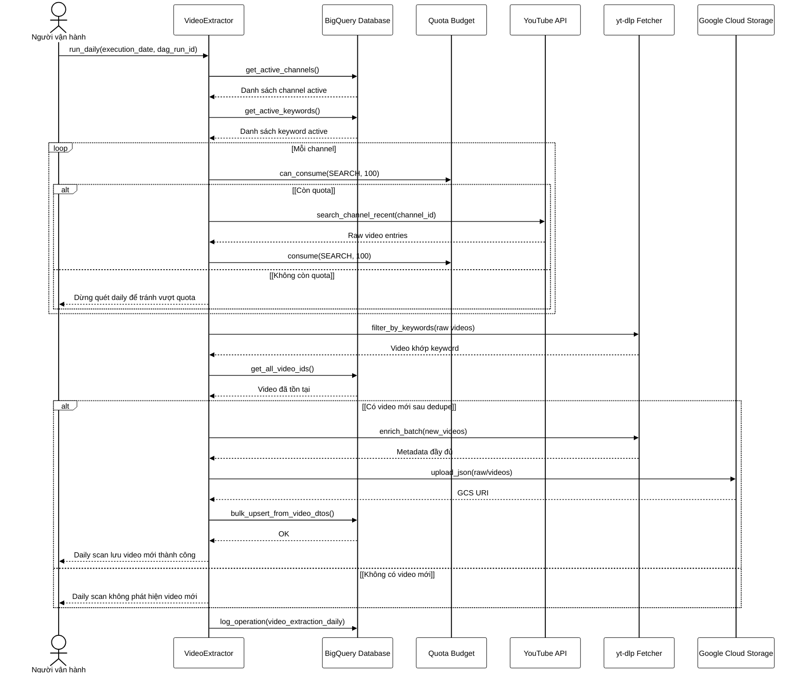

## 4. API Comment Backfill

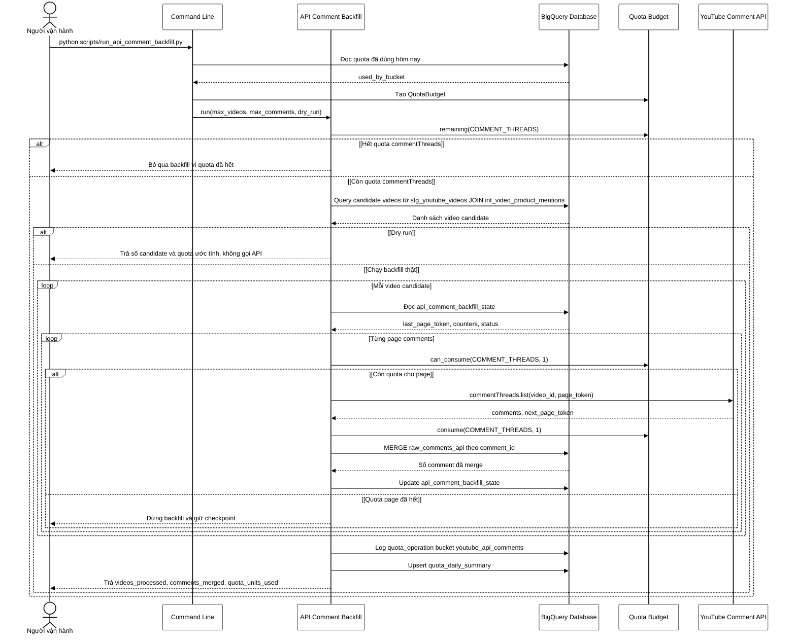

## 5. dbt Transform Raw Sang Marts

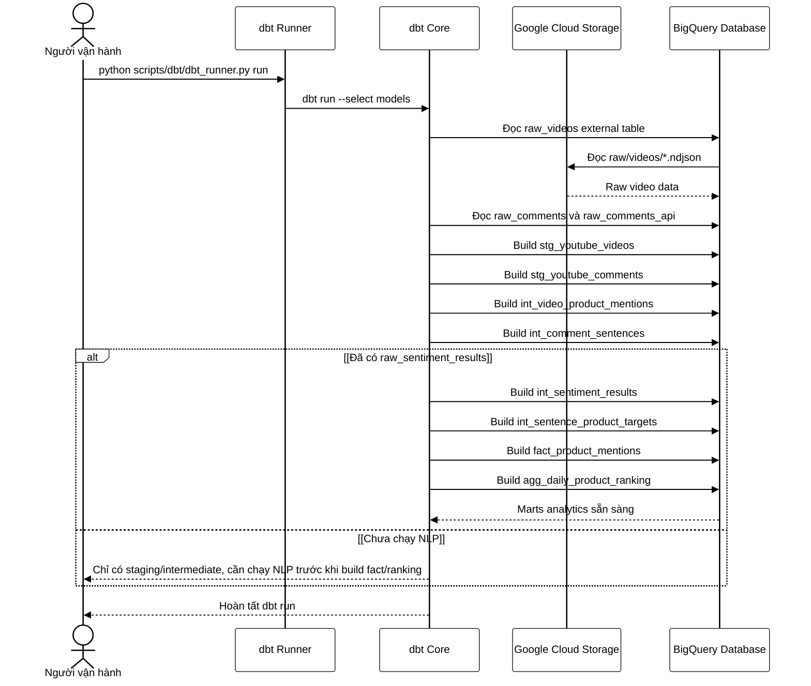

## 6. NLP Hybrid Sentiment Analysis

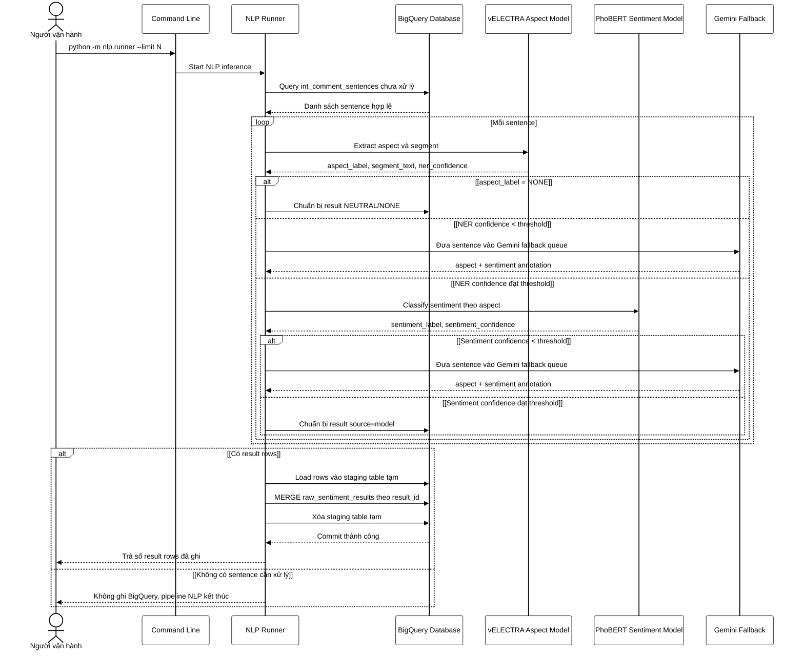

## 7. Resolve Product Target Mơ Hồ

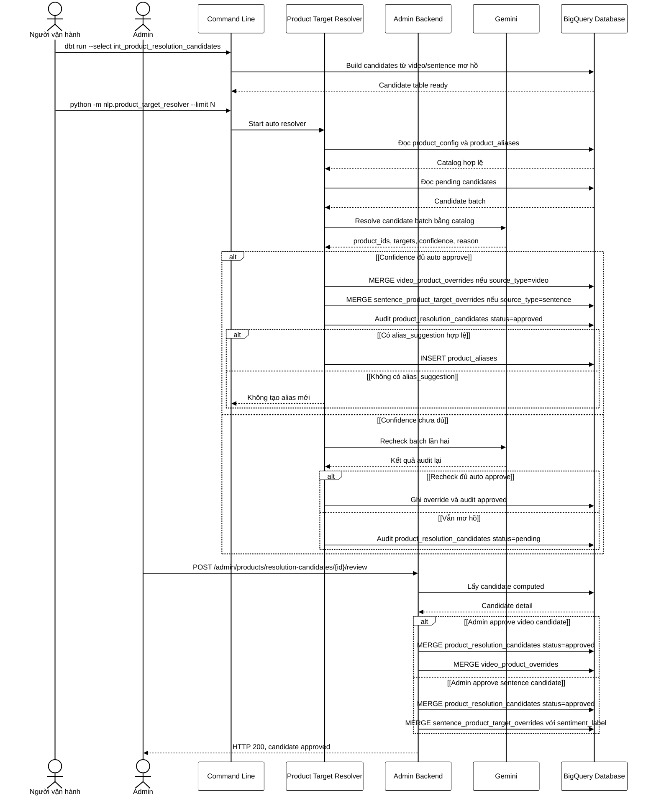

## 8. Analytics PELT Attribution

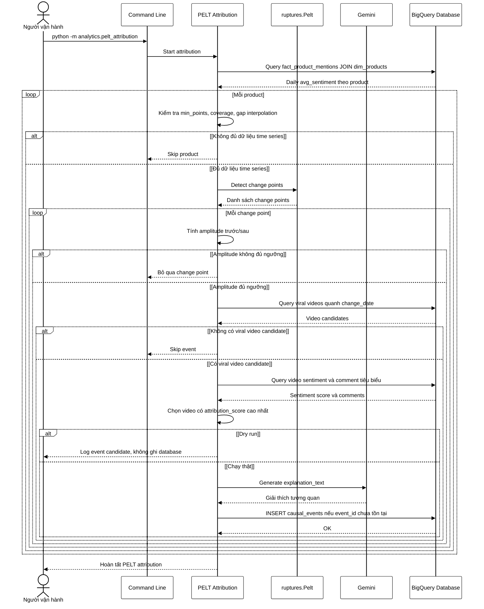

## 9. Public Dashboard Và Product Detail

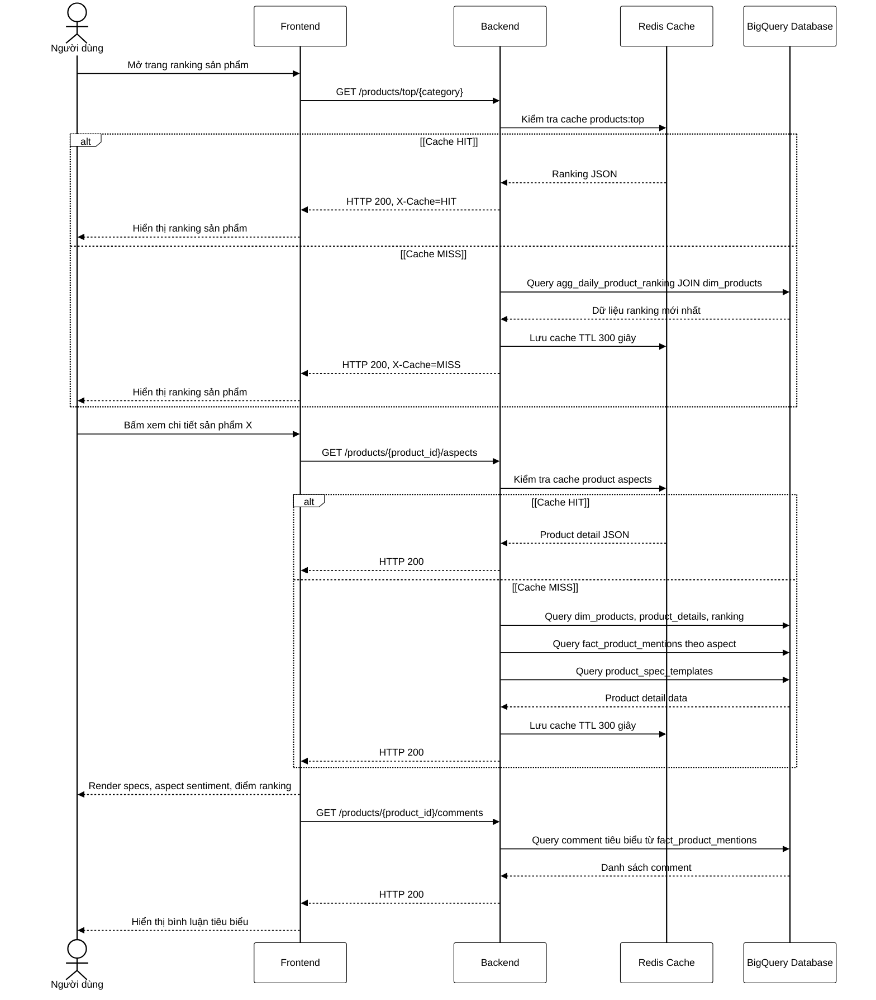

## 10. Đăng Nhập Admin Và Vận Hành Pipeline

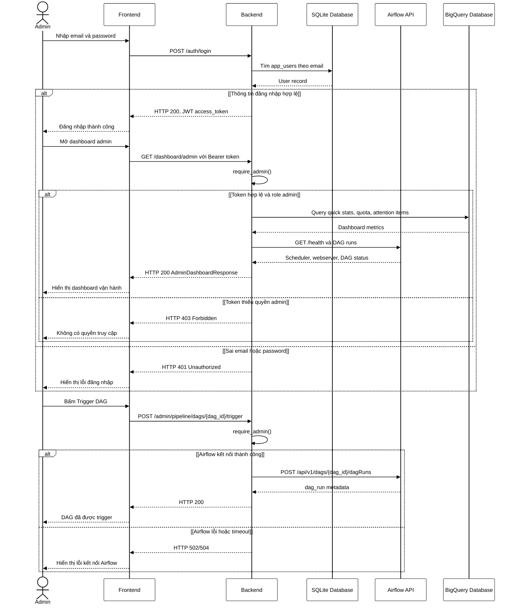

## 11. User Đề Xuất Chỉnh Sửa Product Detail Và Admin Duyệt

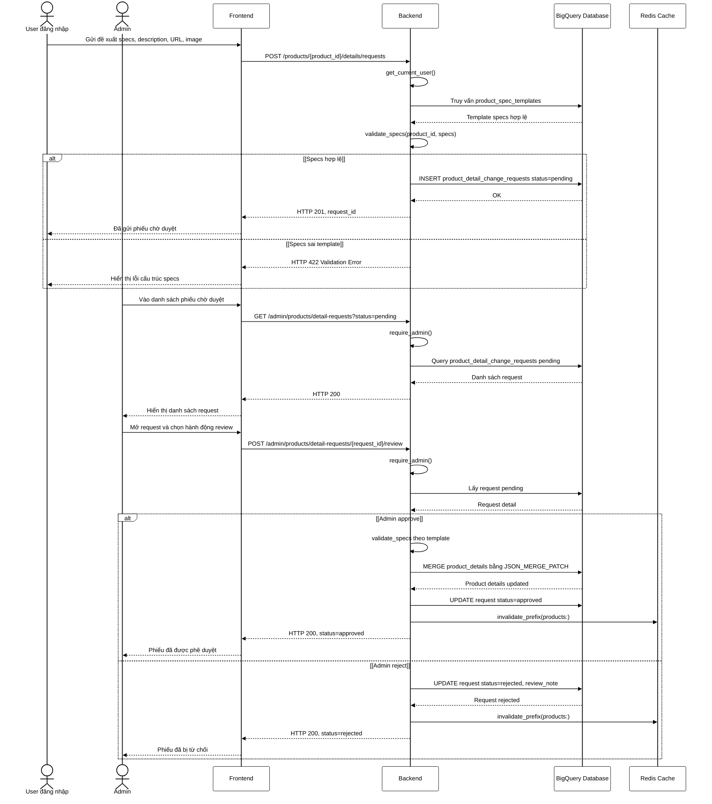
