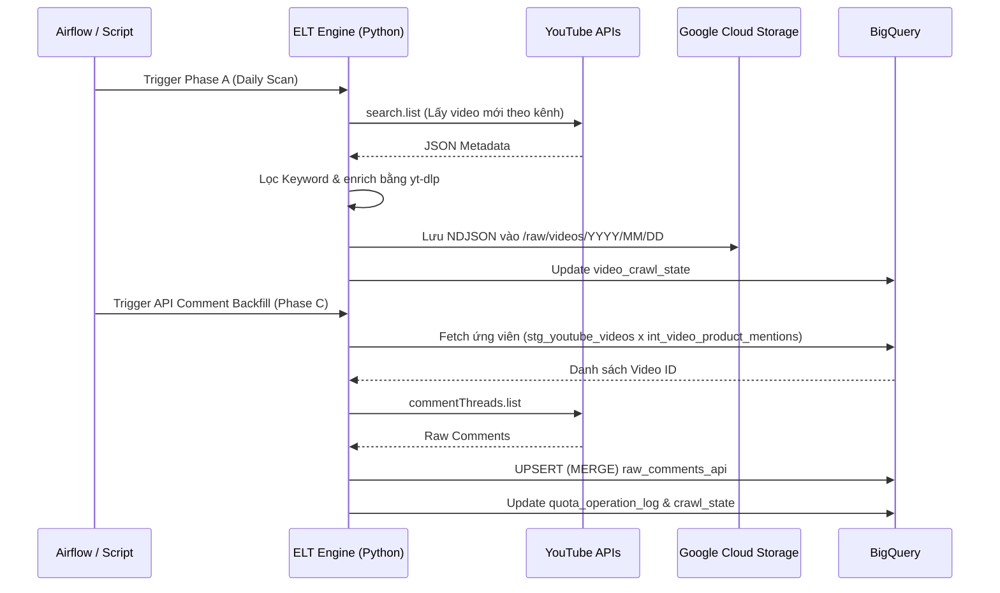
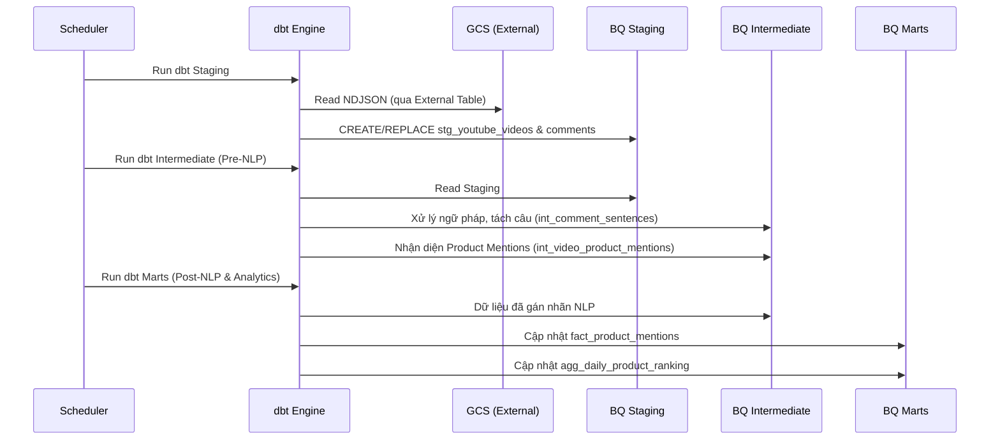
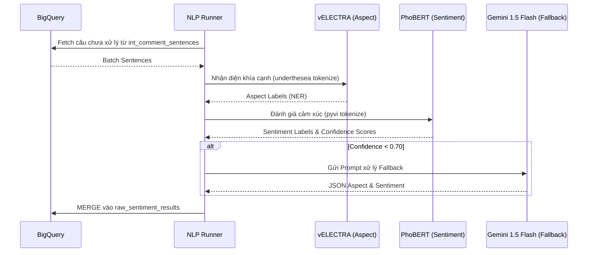
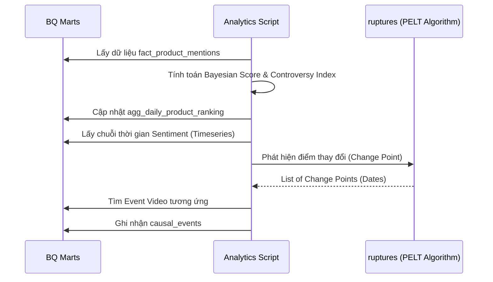
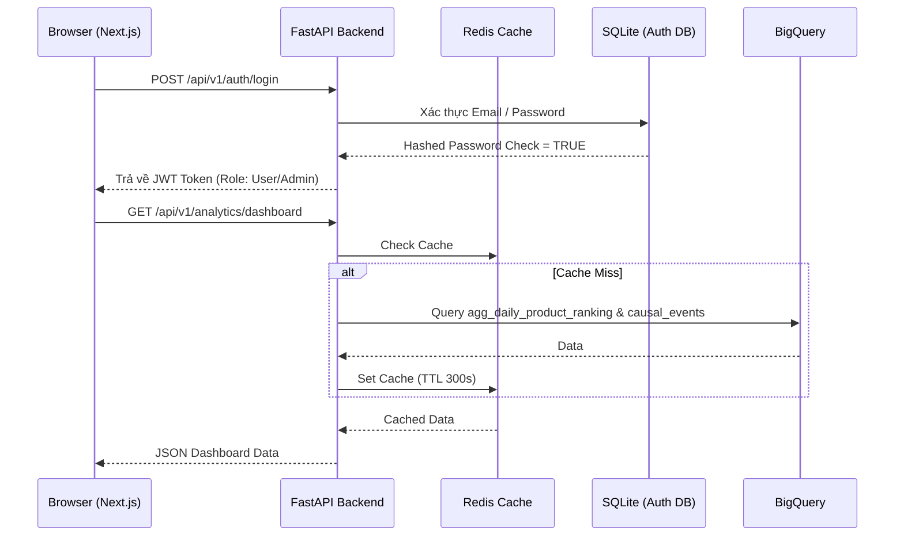

# Tài Liệu Thiết Kế Hệ Thống Chi Tiết - Social Media Sentiment Pipeline

**Tác giả:** Senior Product Owner
**Dự án:** Social Media Sentiment Pipeline
**Phiên bản:** 1.0

---

## 1. Tổng quan dự án và Kiến trúc Hệ thống

### 1.1 Mục tiêu dự án
Hệ thống thu thập bình luận YouTube về các sản phẩm công nghệ Việt Nam (smartphone, laptop, tai nghe, smarthome), phân tích cảm xúc đa chiều (khía cạnh & cảm xúc) và cung cấp insight qua ứng dụng web dành cho Guest/User và Admin. Nền tảng được xây dựng theo chuẩn Data Platform với luồng ELT mạnh mẽ, ứng dụng Hybrid NLP và các thuật toán Analytics chuyên sâu (Bayesian Ranking, PELT Attribution).

### 1.2 Biểu đồ Thiết kế Hệ thống Toàn bộ Dự án
```mermaid
graph TD
    subgraph Data_Ingestion ["1. ELT (Extract & Load)"]
        A1[YouTube Data API v3]
        A2[yt-dlp]
        A3[youtube-comment-downloader]
    end

    subgraph Storage ["2. Cloud Storage & DWH"]
        B1[("Google Cloud Storage\n(Data Lake - NDJSON)")]
        B2[("BigQuery\n(External Tables)") ]
    end

    subgraph Transformation ["3. Transform (dbt)"]
        C1[Layer 2: Staging]
        C2[Layer 3: Intermediate]
        C3[Layer 4: Marts]
    end

    subgraph NLP_Engine ["4. NLP Pipeline"]
        D1["vELECTRA\n(Aspect Extraction)"]
        D2["PhoBERT\n(Sentiment Classification)"]
        D3["Gemini 1.5 Flash\n(Fallback conf < 0.7)"]
    end

    subgraph Analytics_Engine ["5. Analytics & Ranking"]
        E1[Bayesian Ranking]
        E2[Controversy Index]
        E3[PELT Attribution]
    end

    subgraph Application ["6. Web Application & API"]
        F1[FastAPI Backend + Redis]
        F2[Next.js App Router (Frontend)]
        F3[(SQLite Local - Auth DB)]
    end

    A1 --> B1
    A2 --> B1
    A3 --> B1
    B1 -. "Read NDJSON" .-> B2
    B2 --> C1
    C1 --> C2
    C2 --> D1
    D1 --> D2
    D2 -- "Conf < 0.70" --> D3
    D2 -- "Conf >= 0.70" --> C2
    D3 --> C2
    C2 --> C3
    C3 --> E1
    C3 --> E2
    C3 --> E3
    E1 --> F1
    E2 --> F1
    E3 --> F1
    F1 <--> F3
    F1 <--> F2
```

---

## 2. Luồng hoạt động & Biểu đồ Tuần tự (Sequence Diagrams)

### 2.1 Giai đoạn 1: ELT (Extract - Load)
Quá trình ingest dữ liệu tuân thủ quy tắc **GCS-first, BQ-second** và giới hạn API Quota.



### 2.2 Giai đoạn 2: Transform (dbt)
Biến đổi dữ liệu trên BigQuery từ Raw đến Data Marts.



### 2.3 Giai đoạn 3: Phân tích Ngữ nghĩa (NLP Pipeline)
Phân loại Aspect và Sentiment với cơ chế Confidence Routing.



### 2.4 Giai đoạn 4: Analytics Engine
Xử lý dữ liệu định tính thành định lượng và phân tích biến động.



### 2.5 Giai đoạn 5: Frontend & Backend API
Luồng xác thực và truy xuất dữ liệu từ User.



---

## 3. Cấu trúc Database & Mối liên kết (ERD)

Database chính sử dụng BigQuery với kiến trúc 4 lớp (Layers). Dưới đây là cấu trúc bảng và liên kết:

### 3.1 Layer 0: Config (Cấu hình hệ thống)
*   `channel_config`: Danh sách các kênh YouTube cần quét.
*   `keyword_config`: Các từ khóa tìm kiếm (Search Clusters).
*   `product_config`: Danh mục sản phẩm (Nguồn gốc để aggregate ranking).
*   `product_aliases`: Các tên gọi khác (alias) của sản phẩm.
*   `product_details`: Thông tin chi tiết cấu hình (Specs), hình ảnh, URL.
*   `video_crawl_state`: Trạng thái thu thập dữ liệu của từng video.

### 3.2 Layer 1: Raw (Dữ liệu thô GCS)
*   `raw_videos`: Metadata video (External Table từ NDJSON).
*   `raw_comments`: Bình luận thô tải bằng tool (External Table).
*   `raw_sentiment_results`: Kết quả phân tích NLP raw được UPSERT trực tiếp từ code Python.

### 3.3 Layer 2: Staging (Chuẩn hóa)
*   `stg_youtube_videos`: Dữ liệu video đã làm sạch, xử lý datatype.
*   `stg_youtube_comments`: Dữ liệu comment làm sạch.

### 3.4 Layer 3: Intermediate (Bảng trung gian)
*   `int_comment_sentences`: Bình luận tách thành từng câu độc lập.
*   `int_sentiment_results`: Kết quả NLP đã join với metadata.
*   `finetune_dataset`: Tập dữ liệu chuẩn bị cho quá trình huấn luyện lại mô hình (Human in the loop).
*   `int_video_product_mentions`: Nhận diện video nói về sản phẩm nào.
*   `int_sentence_product_targets`: Mapping từng câu nói cụ thể target vào sản phẩm nào.
*   `int_product_resolution_candidates`: Các ứng viên chưa thể match với product catalog (dành cho Admin duyệt).

### 3.5 Layer 4: Marts (Bảng phân tích)
*   `dim_products`: Dimension table của sản phẩm.
*   `fact_product_mentions`: Fact table ghi nhận mỗi lượt nhắc đến sản phẩm kèm cảm xúc.
*   `agg_daily_product_ranking`: Aggregate bảng xếp hạng hàng ngày với Bayesian Score và Controversy Index.
*   `causal_events`: Chứa sự kiện thay đổi cảm xúc do PELT Attribution sinh ra.

### 3.6 Quan hệ các bảng chính (ERD relationships)
*   `product_config` (1) - (N) `product_aliases`
*   `product_config` (1) - (1) `product_details`
*   `channel_config` (1) - (N) `stg_youtube_videos`
*   `stg_youtube_videos` (1) - (N) `stg_youtube_comments`
*   `stg_youtube_comments` (1) - (N) `int_comment_sentences`
*   `int_comment_sentences` (1) - (N) `int_sentiment_results`
*   `dim_products` (1) - (N) `fact_product_mentions`
*   `dim_products` (1) - (N) `agg_daily_product_ranking`
*   `dim_products` (1) - (N) `causal_events`

---

## 4. Class Models (API Backend & Frontend)

### 4.1 Backend (FastAPI - Python)

**A. Models Database cục bộ (SQLAlchemy - SQLite)**
Được sử dụng duy nhất cho chức năng Authentication.
*   `AppUser`: id, email, display_name, hashed_password, role, is_active, created_at, last_login_at.

**B. Response Schemas (Pydantic)**
*   `ProductDetailResponse`: product_id, product_name, bayesian_score, controversy_label, aspects[], details, spec_templates[], as_of_date.
*   `AspectSentiment`: aspect_label, positive_count, negative_count, neutral_count, total_mentions, positive_pct, negative_pct.
*   `AttributionResponse`: product_id, product_name, events[].
*   `SearchResultItem`: rank, product_id, bayesian_score, positive_pct,...
*   `AdminDashboardResponse`: pipeline_status, quick_stats, mention_series[], recent_dag_runs[], attention_items[].
*   `UserDashboardResponse`: category_stats[], top_products[], latest_causal_events[].
*   `PipelineHealthResponse`: airflow (webserver, scheduler), recent_dag_runs[], metrics.
*   `TokenResponse`: access_token, token_type, role.

**C. Request Schemas (Pydantic)**
*   `RegisterRequest` / `LoginRequest`: email, password, display_name.
*   `ProductDetailChangeRequestCreate`: proposed_specs, proposed_description, proposed_official_url, proposed_image_url.
*   `ProductDetailChangeRequestReview`: action (approve/reject), review_note.

### 4.2 Frontend (Next.js - TypeScript)

Hệ thống TypeScript Interface mapping chính xác 1-1 với Pydantic backend. Toàn bộ types nằm tại `frontend/lib/types.ts`.

**A. Authentication**
```typescript
export interface TokenResponse { access_token: string; token_type: string; role: "user" | "admin"; }
export interface UserInfo { id: string; email: string; display_name: string; role: "user" | "admin"; created_at: string; }
```

**B. Analytics & Products**
```typescript
export interface TopProduct { rank: number; product_id: string; product_name: string; brand: string; category: string; bayesian_score: number; controversy_label: "high" | "medium" | "low"; total_mentions: number; positive_pct: number; negative_pct: number; top_aspect: string | null; }
export interface AspectSentiment { aspect_label: string; positive_count: number; negative_count: number; neutral_count: number; total_mentions: number; positive_pct: number; negative_pct: number; }
export interface CausalEventSummary { product_name: string; change_point_date: string; sentiment_direction: "POSITIVE" | "NEGATIVE"; event_video_title: string; event_view_count: number; explanation_text: string; }
```

**C. Admin Dashboard & Pipeline Health**
```typescript
export interface PipelineStatus { airflow_webserver: string; airflow_scheduler: string; quota_used_today: number; quota_limit: number; last_nlp_batch_run_id: string | null; nlp_fallback_pct: number | null; }
export interface DagRunSummary { dag_id: string; run_id: string; state: "success" | "failed" | "running" | "queued"; start_date: string | null; duration_seconds: number | null; }
```

**D. Moderation & Catalog**
```typescript
export interface ProductDetailChangeRequestItem { request_id: string; product_id: string; proposed_specs: Record<string, unknown> | null; proposed_description: string | null; status: "pending" | "approved" | "rejected"; submitted_by: string; created_at: string; }
export interface ProductResolutionCandidate { candidate_id: string; source_type: string; source_id: string; candidate_text: string; status: string; resolved_product_id: string | null; created_at: string; }
```

---
*Tài liệu được thiết kế chi tiết bao quát toàn diện các khía cạnh kỹ thuật, đáp ứng vai trò quản trị dự án & chuyển giao công nghệ.*
